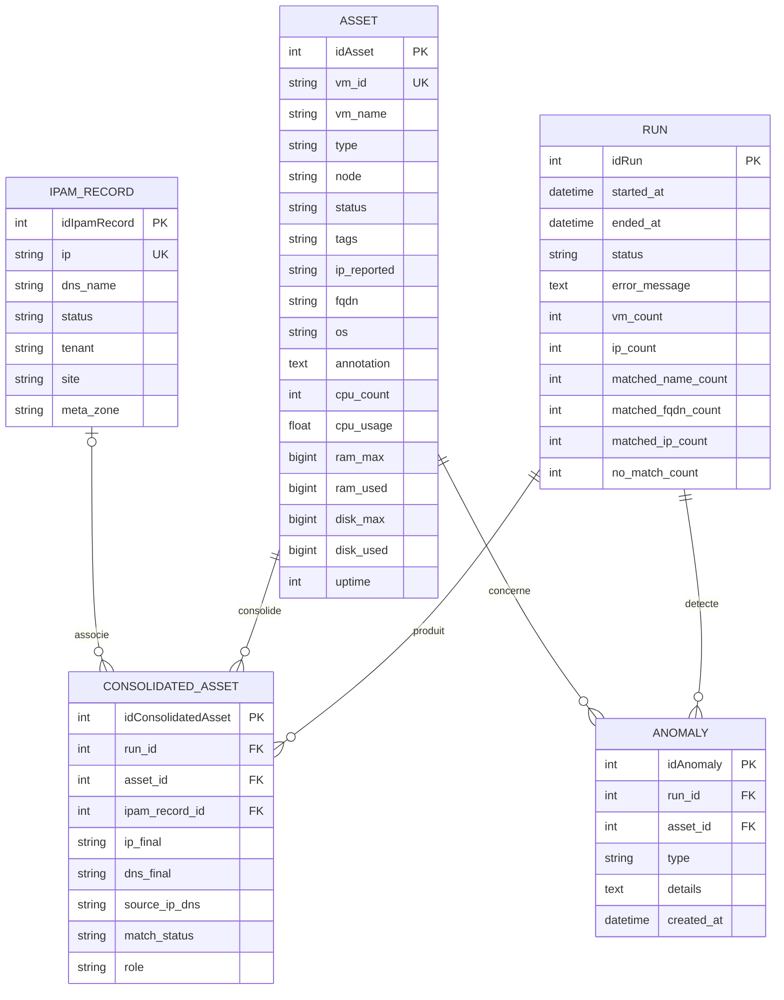
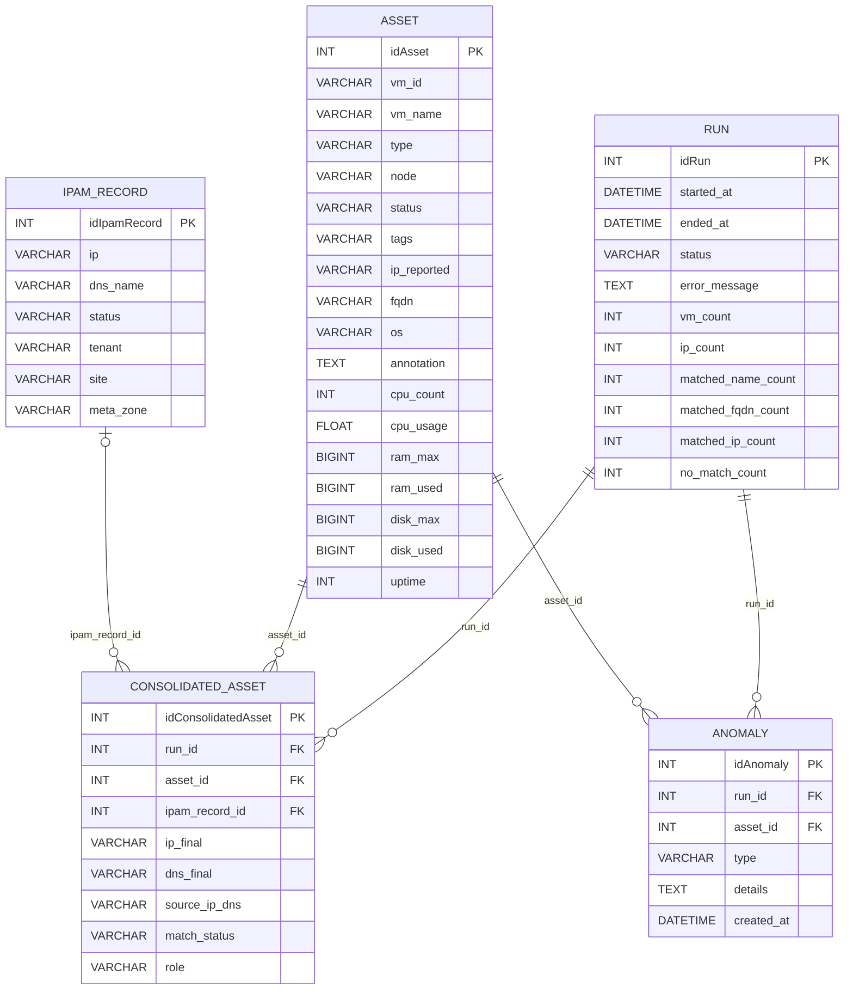
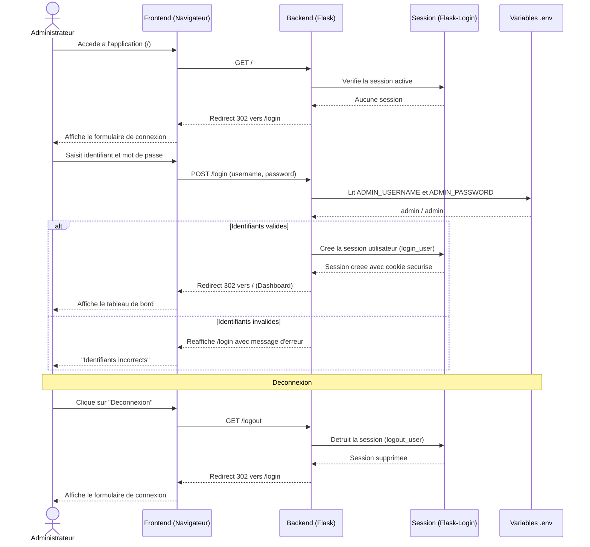
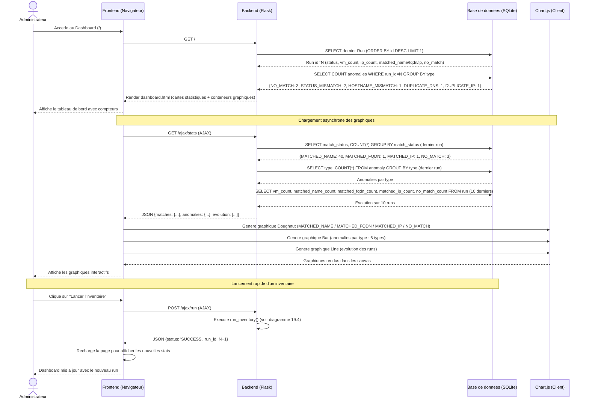
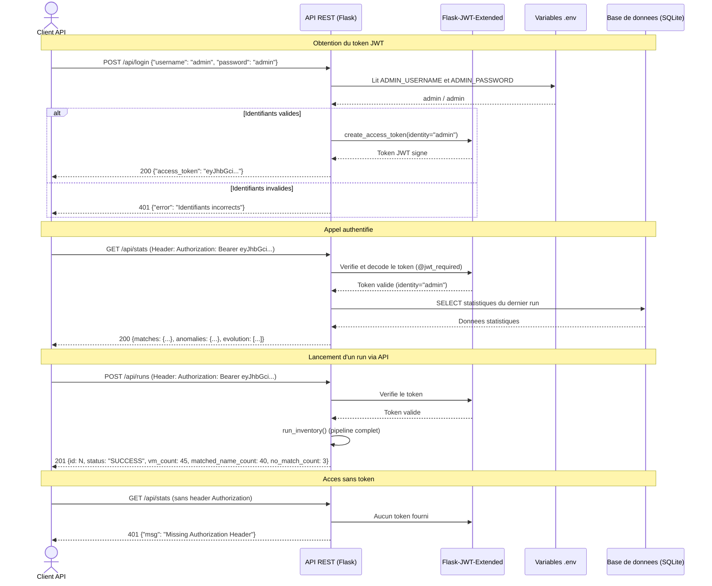

# Cahier des Charges — CloudInventory v2.0

## Table des matieres

1. [Presentation du projet](#1-presentation-du-projet)
2. [Contexte et problematique](#2-contexte-et-problematique)
3. [Objectifs du projet](#3-objectifs-du-projet)
4. [Perimetre fonctionnel](#4-perimetre-fonctionnel)
5. [Architecture technique](#5-architecture-technique)
6. [Modele de donnees](#6-modele-de-donnees)
7. [Algorithme de consolidation](#7-algorithme-de-consolidation)
8. [Description des fonctionnalites](#8-description-des-fonctionnalites)
9. [API REST](#9-api-rest)
10. [Securite et authentification](#10-securite-et-authentification)
11. [Interface utilisateur](#11-interface-utilisateur)
12. [Infrastructure et deploiement](#12-infrastructure-et-deploiement)
13. [Jeux de donnees de test](#13-jeux-de-donnees-de-test)
14. [Tests et validation](#14-tests-et-validation)
15. [Contraintes techniques](#15-contraintes-techniques)
16. [Evolutions prevues](#16-evolutions-prevues)
17. [Livrables](#17-livrables)
18. [Glossaire](#18-glossaire)
19. [Diagrammes](#19-diagrammes)

---

## 1. Presentation du projet

### 1.1 Intitule

**CloudInventory** — Application web d'inventaire et de supervision d'infrastructure virtualisee.

### 1.2 Cadre

Projet realise dans le cadre du **BTS SIO option SLAM** (Solutions Logicielles et Applications Metiers), epreuve E5 — Production et fourniture de services informatiques.

### 1.3 Auteur

Marceau — Etudiant BTS SIO SLAM.

### 1.4 Version

v2.0 — Consolidation multi-strategie, deduction de role, sources reelles et simulees.

---

## 2. Contexte et problematique

### 2.1 Contexte

Dans une infrastructure virtualisee, les machines virtuelles (VM) et conteneurs (CT) sont geres via un hyperviseur (Proxmox VE), tandis que les adresses IP et les enregistrements DNS sont geres dans un outil IPAM (NetBox). Ces deux sources de verite sont independantes et peuvent diverger au fil du temps.

### 2.2 Problematique

Sans outil centralise, les administrateurs systeme font face a plusieurs difficultes :

- **Manque de visibilite** : pas de vue consolidee entre l'hyperviseur et l'IPAM.
- **Incoherences non detectees** : une VM peut etre arretee alors que son IP reste active dans NetBox, ou inversement.
- **Machines orphelines** : des VM existent dans l'hyperviseur sans aucune correspondance dans l'IPAM (aucune documentation reseau).
- **Doublons** : des enregistrements DNS ou IP dupliques passent inapercus.
- **Absence d'historique** : aucun suivi de l'evolution du parc dans le temps.
- **Renommages non detectes** : une VM renommee perd sa correspondance IPAM sans alerte.

### 2.3 Solution proposee

CloudInventory automatise la collecte, la consolidation et l'analyse des donnees provenant de ces deux sources. Il genere un inventaire consolide via un algorithme de matching multi-strategie (hostname, FQDN, IP), detecte automatiquement 6 types d'anomalies, deduit le role fonctionnel de chaque asset et offre un suivi historique via une interface web intuitive et une API REST documentee.

---

## 3. Objectifs du projet

### 3.1 Objectifs fonctionnels

| # | Objectif | Priorite |
|---|----------|----------|
| OF1 | Collecter les donnees de virtualisation (VM/CT) depuis Proxmox VE ou mock | Haute |
| OF2 | Collecter les donnees IPAM/DNS depuis NetBox ou mock | Haute |
| OF3 | Consolider les deux sources via matching multi-strategie (hostname, FQDN, IP) | Haute |
| OF4 | Detecter automatiquement 6 types d'anomalies d'infrastructure | Haute |
| OF5 | Deduire le role fonctionnel de chaque asset (convention de nommage + tags) | Haute |
| OF6 | Fournir un tableau de bord avec indicateurs cles et graphiques | Haute |
| OF7 | Permettre la consultation, le filtrage et le tri de l'inventaire | Haute |
| OF8 | Exporter l'inventaire au format CSV | Moyenne |
| OF9 | Comparer deux executions (runs) pour suivre l'evolution | Moyenne |
| OF10 | Consulter l'historique detaille de chaque asset sur 30 runs | Moyenne |
| OF11 | Exposer une API REST documentee (Swagger/OpenAPI) | Moyenne |
| OF12 | Notifications email SMTP en cas d'anomalies (rapport HTML) | Moyenne |
| OF13 | Notifications webhook apres chaque run avec anomalies | Faible |
| OF14 | Exports automatiques apres chaque run (JSONL.gz consolide, rapport MD) | Moyenne |
| OF15 | Stockage des exports sur serveur Samba ou dossier local | Moyenne |
| OF16 | Retention automatique des exports (30j consolides, 7j bruts) | Faible |

### 3.2 Objectifs techniques

| # | Objectif | Priorite |
|---|----------|----------|
| OT1 | Authentification securisee (sessions web + JWT API) | Haute |
| OT2 | Base de donnees relationnelle avec ORM (5 tables) | Haute |
| OT3 | Architecture modulaire (Blueprints Flask) | Haute |
| OT4 | Sources interchangeables (mock / API reelle) via variables d'environnement | Haute |
| OT5 | Conteneurisation Docker | Moyenne |
| OT6 | Couverture de tests automatises (81 tests) | Moyenne |
| OT7 | Interface responsive (mobile/tablette/desktop) | Moyenne |
| OT8 | Systeme d'exports automatiques avec retention configurable | Moyenne |
| OT9 | Integration SMTP pour notifications email HTML | Moyenne |

---

## 4. Perimetre fonctionnel

### 4.1 Dans le perimetre (v2.0)

- Collecte de donnees a partir de **sources simulees** (mock Proxmox + mock NetBox) **ou reelles** (API Proxmox VE + API NetBox).
- Consolidation automatique avec **algorithme de matching multi-strategie** (4 niveaux de priorite).
- **Deduction automatique du role fonctionnel** (convention de nommage lettre+chiffres + tags).
- Detection de **6 types d'anomalies**.
- Interface web complete avec tableau de bord, inventaire, historique, anomalies.
- API REST avec authentification JWT et documentation Swagger.
- Export CSV de l'inventaire.
- Comparaison entre deux executions.
- Deploiement Docker.
- **Notifications email SMTP** (rapport HTML avec stats, badges, tableau d'anomalies).
- **Notifications webhook** apres chaque run avec anomalies.
- **Badge d'anomalies** dans la navbar et **bandeau d'alerte** sur le dashboard.
- **Exports automatiques** apres chaque run :
  - Export consolide **JSONL.gz** (1 ligne = 1 VM, retention 30 jours).
  - Rapport de run **Markdown** (ecrase a chaque execution).
  - Exports bruts **JSON.gz** optionnels (retention 7 jours, pour debug/rejeu).
- **Stockage configurable** : dossier local ou partage **Samba** (SMB).
- **Politique de retention** automatique avec nettoyage des fichiers expires.

### 4.2 Hors perimetre (evolutions futures)

- Planification automatique des collectes (cron/scheduler).
- Gestion multi-utilisateurs avec roles et permissions.
- Tableaux de bord personnalisables.
- HTTPS en production.

---

## 5. Architecture technique

### 5.1 Stack technologique

| Composant | Technologie | Version |
|-----------|-------------|---------|
| Langage backend | Python | 3.12+ |
| Framework web | Flask | 3.1.0 |
| ORM | Flask-SQLAlchemy | 3.1.1 |
| Auth sessions | Flask-Login | 0.6.3 |
| Auth API (JWT) | Flask-JWT-Extended | 4.7.1 |
| Doc API | Flasgger (Swagger/OpenAPI) | 0.9.7.1 |
| Client HTTP | requests | 2.32.3 |
| Variables d'env | python-dotenv | 1.1.0 |
| Base de donnees | SQLite | integre |
| Tests | pytest | 8.3.4 |
| Framework CSS | Bootstrap | 5.3.3 |
| Icones | Bootstrap Icons | 1.11.3 |
| Graphiques | Chart.js | 4.4.7 |
| Moteur de templates | Jinja2 | integre (Flask) |
| Conteneurisation | Docker + Docker Compose | - |
| Versioning | Git / GitHub | - |

### 5.2 Architecture applicative

```
CloudInventory.v2-1/
|
|-- app/                          # Application Flask
|   |-- __init__.py               # Factory + init extensions (JWT, Swagger, Login)
|   |-- auth.py                   # Blueprint authentification (Flask-Login)
|   |-- models.py                 # Modeles SQLAlchemy (5 tables)
|   |-- routes.py                 # Blueprint routes web (dashboard, inventaire, runs...)
|   |-- api.py                    # Blueprint API REST (JWT)
|   |-- queries.py                # Requetes et helpers partages (build_inventory_query, etc.)
|   |-- templates/                # Templates Jinja2 (9 pages)
|       |-- base.html             # Layout de base avec navigation
|       |-- login.html            # Formulaire d'authentification
|       |-- dashboard.html        # Tableau de bord avec graphiques
|       |-- inventory.html        # Liste filtrable et paginee
|       |-- runs.html             # Historique des executions
|       |-- run_detail.html       # Detail d'un run (inventaire + anomalies)
|       |-- run_compare.html      # Comparaison entre deux runs
|       |-- asset_detail.html     # Fiche VM avec historique
|       |-- anomalies.html        # Liste filtrable des anomalies
|
|-- collector/                    # Module de collecte
|   |-- __init__.py
|   |-- inventory_runner.py       # Orchestrateur (consolidation multi-strategie + anomalies)
|   |-- mock_virtualisation.py    # Donnees simulees Proxmox (45 VMs/CTs)
|   |-- mock_netbox.py            # Donnees simulees NetBox (44 records)
|   |-- proxmox_client.py         # Client API Proxmox VE (reel)
|   |-- netbox_client.py          # Client API NetBox (reel)
|
|-- tests/                        # Tests automatises (58 tests)
|   |-- test_app.py               # Tests web : modeles, routes, consolidation (34 tests)
|   |-- test_api.py               # Tests API REST : JWT, endpoints, filtres (24 tests)
|
|-- run.py                        # Point d'entree
|-- requirements.txt              # Dependances Python (8 packages)
|-- Dockerfile                    # Image Docker (Python 3.12-slim)
|-- docker-compose.yml            # Orchestration conteneurs
|-- .env.example                  # Variables d'environnement (template)
```

### 5.3 Schema d'architecture

```
+-------------------+          +-------------------+
|   Source A         |          |   Source B         |
|   Proxmox VE      |          |   NetBox (IPAM)    |
|   (mock ou reel)  |          |   (mock ou reel)   |
+--------+----------+          +----------+---------+
         |                                |
         v                                v
+------------------------------------------------+
|        Moteur de consolidation multi-strategie  |
|         (collector/inventory_runner.py)          |
|                                                  |
|  1. Collecte VM/CT      2. Collecte IPAM         |
|  3. Upsert en base      4. Matching 4 niveaux    |
|     (hostname → FQDN → IP → NO_MATCH)           |
|  5. Deduction de role    6. Detection anomalies   |
|  7. Compteurs + finalisation run                  |
+------------------------+-------------------------+
                         |
                         v
              +----------+---------+
              |     SQLite DB      |
              |  (5 tables ORM)    |
              +----------+---------+
                         |
            +------------+------------+
            |                         |
            v                         v
   +--------+--------+      +--------+--------+
   |  Interface Web   |      |    API REST      |
   |  (Flask-Login)   |      |  (JWT + Swagger) |
   |                  |      |                  |
   |  - Dashboard     |      |  POST /api/login |
   |  - Inventaire    |      |  GET  /api/stats |
   |  - Runs          |      |  GET  /api/runs  |
   |  - Anomalies     |      |  GET  /api/inv.  |
   |  - Export CSV    |      |  GET  /api/anom. |
   |  - Asset Detail  |      |  GET  /api/assets|
   +------------------+      +-----------------+
```

---

## 6. Modele de donnees

### 6.1 Dictionnaire des donnees

#### Table `run` — Executions d'inventaire

| Champ | Type | Contrainte | Description |
|-------|------|------------|-------------|
| id | INTEGER | PK, auto-increment | Identifiant unique du run |
| started_at | DATETIME | NOT NULL, default=now(UTC) | Date/heure de debut |
| ended_at | DATETIME | nullable | Date/heure de fin |
| status | VARCHAR(20) | NOT NULL, default=RUNNING | Statut : RUNNING, SUCCESS, FAIL |
| error_message | TEXT | nullable | Message d'erreur en cas d'echec |
| vm_count | INTEGER | default=0 | Nombre de VM collectees |
| ip_count | INTEGER | default=0 | Nombre d'enregistrements IPAM collectes |
| matched_name_count | INTEGER | default=0 | Correspondances par hostname |
| matched_fqdn_count | INTEGER | default=0 | Correspondances par FQDN |
| matched_ip_count | INTEGER | default=0 | Correspondances par IP |
| no_match_count | INTEGER | default=0 | VM sans correspondance |

#### Table `asset` — Machines virtuelles et conteneurs

| Champ | Type | Contrainte | Description |
|-------|------|------------|-------------|
| id | INTEGER | PK, auto-increment | Identifiant interne |
| vm_id | VARCHAR(50) | NOT NULL | Identifiant source (Proxmox VMID) |
| vm_name | VARCHAR(100) | NOT NULL | Nom de la VM/CT |
| type | VARCHAR(20) | | Type : qemu (VM) ou lxc (conteneur) |
| node | VARCHAR(100) | | Noeud hyperviseur hebergeant l'asset |
| status | VARCHAR(20) | | Statut : running, stopped |
| tags | VARCHAR(200) | nullable | Tags au format CSV (ex: "env:prod, role:web, os:debian-12") |
| ip_reported | VARCHAR(45) | nullable | Adresse IP rapportee par le QEMU Guest Agent |
| fqdn | VARCHAR(255) | nullable | Nom de domaine complet de la VM |
| os | VARCHAR(100) | nullable | Systeme d'exploitation de la VM |
| annotation | TEXT | nullable | Note ou description libre |
| cpu_count | INTEGER | nullable | Nombre de vCPU alloues |
| cpu_usage | FLOAT | nullable | Utilisation CPU en pourcentage |
| ram_max | BIGINT | nullable | RAM allouee en octets |
| ram_used | BIGINT | nullable | RAM utilisee en octets |
| disk_max | BIGINT | nullable | Espace disque alloue en octets |
| disk_used | BIGINT | nullable | Espace disque utilise en octets |
| uptime | INTEGER | nullable | Duree de fonctionnement en secondes |

#### Table `ipam_record` — Enregistrements IPAM/DNS

| Champ | Type | Contrainte | Description |
|-------|------|------------|-------------|
| id | INTEGER | PK, auto-increment | Identifiant interne |
| ip | VARCHAR(45) | NOT NULL | Adresse IP |
| dns_name | VARCHAR(200) | nullable | Nom DNS associe |
| status | VARCHAR(50) | nullable | Statut : active, reserved, deprecated |
| tenant | VARCHAR(100) | nullable | Organisation/tenant proprietaire |
| site | VARCHAR(100) | nullable | Site physique (datacenter) |
| meta_zone | VARCHAR(100) | nullable | Zone reseau (ZM, ZCS, ZE) |

#### Table `consolidated_asset` — Inventaire consolide

| Champ | Type | Contrainte | Description |
|-------|------|------------|-------------|
| id | INTEGER | PK, auto-increment | Identifiant interne |
| run_id | INTEGER | FK -> run.id, NOT NULL | Run de reference |
| asset_id | INTEGER | FK -> asset.id, NOT NULL | Asset associe |
| ipam_record_id | INTEGER | FK -> ipam_record.id, nullable | Enregistrement IPAM associe (si match) |
| ip_final | VARCHAR(45) | nullable | IP consolidee finale |
| dns_final | VARCHAR(200) | nullable | DNS consolide final |
| source_ip_dns | VARCHAR(20) | | Source des donnees IP/DNS : NETBOX ou VIRT |
| match_status | VARCHAR(30) | | Resultat : MATCHED_NAME, MATCHED_FQDN, MATCHED_IP, NO_MATCH |
| role | VARCHAR(50) | default="Indetermine" | Role fonctionnel deduit |

#### Table `anomaly` — Anomalies detectees

| Champ | Type | Contrainte | Description |
|-------|------|------------|-------------|
| id | INTEGER | PK, auto-increment | Identifiant interne |
| run_id | INTEGER | FK -> run.id, NOT NULL | Run ayant detecte l'anomalie |
| asset_id | INTEGER | FK -> asset.id, NOT NULL | Asset concerne |
| type | VARCHAR(50) | NOT NULL | Type d'anomalie (voir 6.2) |
| details | TEXT | nullable | Description detaillee |
| created_at | DATETIME | default=now(UTC) | Date de detection |

### 6.2 Types d'anomalies detectees

| Code | Description | Condition de declenchement |
|------|-------------|---------------------------|
| NO_MATCH | VM sans correspondance IPAM | Aucune correspondance trouvee (ni hostname, ni FQDN, ni IP) |
| MATCHED_IP | Correspondance par IP uniquement | L'IP match mais le hostname ne correspond pas au DNS NetBox |
| HOSTNAME_MISMATCH | Divergence hostname/DNS | VM matchee par IP mais hostname different du DNS NetBox |
| STATUS_MISMATCH | Incoherence de statut | VM arretee (stopped) mais IP active dans NetBox |
| DUPLICATE_DNS | Doublon DNS | Meme nom DNS present dans plusieurs enregistrements IPAM |
| DUPLICATE_IP | Doublon IP | Meme adresse IP presente dans plusieurs enregistrements IPAM |

### 6.3 Relations entre entites

```
Run (1) ----< (N) ConsolidatedAsset (N) >---- (1) Asset
                        |
                        | (0..1)
                        v
                   IpamRecord (1)

Run (1) ----< (N) Anomaly (N) >---- (1) Asset
```

- Un **Run** produit plusieurs **ConsolidatedAsset** et plusieurs **Anomaly**.
- Un **Asset** peut apparaitre dans plusieurs runs (historique).
- Un **ConsolidatedAsset** est lie a exactement un **Asset** et optionnellement a un **IpamRecord**.
- Une **Anomaly** est liee a un **Run** et a un **Asset**.

---

## 7. Algorithme de consolidation

### 7.1 Matching multi-strategie

L'algorithme de consolidation applique 4 strategies de correspondance par ordre de priorite decroissante :

```
Pour chaque Asset :
  |
  |-- Strategie 1 : MATCHED_NAME (hostname normalise)
  |   Condition : normalize(asset.vm_name) == normalize(ipam.dns_name)
  |   Source : NETBOX (source de verite reseau)
  |   → Si match ET asset.stopped ET ipam.active → Anomalie STATUS_MISMATCH
  |
  |-- Strategie 2 : MATCHED_FQDN (premier segment du FQDN)
  |   Condition : normalize(asset.fqdn).split('.')[0] == normalize(ipam.dns_name)
  |   Source : NETBOX
  |
  |-- Strategie 3 : MATCHED_IP (fallback par adresse IP)
  |   Condition : asset.ip_reported == ipam.ip
  |   Source : NETBOX
  |   → Anomalie HOSTNAME_MISMATCH (hostname ≠ DNS NetBox)
  |
  |-- Strategie 4 : NO_MATCH (aucune correspondance)
  |   Source : VIRT (donnees hyperviseur uniquement)
  |   → Anomalie NO_MATCH
```

### 7.2 Normalisation des hostnames

- Conversion en minuscules.
- Suppression des espaces.
- Suppression du suffixe de domaine (ex: `web-a500.prod.local` → `web-a500`).

### 7.3 Deduction du role fonctionnel

Deux strategies combinees :

**Strategie 1 — Convention de nommage (lettre + 3 chiffres)** :

| Lettre | Role |
|--------|------|
| a | Application |
| b | Base de donnees |
| c | Communication |
| d | DNS |
| f | Fichiers |
| h | Hyperviseur |
| i | Impression |
| j | Journalisation |
| k | SSI |
| l | Authentification |
| m | Messagerie |
| n | News |
| o | Proxy |
| p | Pare-feu |
| r | Ressources |
| s | Supervision |
| t | Temps |
| v | Correctifs |
| w | Web |
| x | Annuaire |
| z | Multifonctions |

Exemple : `web-a500` → lettre `a` → "Application".

**Strategie 2 — Tags `role:xxx`** :

Si aucune lettre+chiffres n'est trouvee, le tag `role:xxx` de la VM est utilise. Correspondances : `web` → Web, `api` → Application, `database` → Base de donnees, `cache` → Communication, `proxy` → Proxy, `loadbalancer` → Proxy, `logs` → Journalisation, `dns` → DNS, `auth` → Authentification, `mail` → Messagerie, `firewall` → Pare-feu, `monitoring` → Supervision, `secrets` → SSI, `ci` → Ressources, etc.

### 7.4 Detection des anomalies IPAM

Apres la consolidation, un second passage detecte les doublons dans les enregistrements IPAM :

- **DUPLICATE_DNS** : comptage par `dns_name` normalise → anomalie si count > 1.
- **DUPLICATE_IP** : comptage par `ip` → anomalie si count > 1.

---

## 8. Description des fonctionnalites

### 8.1 Tableau de bord (Dashboard)

**Route** : `GET /`

**Description** : Page d'accueil affichant une vue synthetique de l'etat de l'infrastructure.

**Elements affiches** :
- 4 cartes statistiques : nombre total de VM, correspondances, non-correspondances, anomalies.
- 3 graphiques interactifs (Chart.js) :
  - **Doughnut** : repartition correspondances / non-correspondances.
  - **Barres** : anomalies par type (NO_MATCH, STATUS_MISMATCH, HOSTNAME_MISMATCH, etc.).
  - **Ligne** : evolution sur les 10 derniers runs (VM, matched, no_match).
- Bouton "Lancer l'inventaire" (appel AJAX asynchrone).
- Informations du dernier run (date, statut, compteurs).

**Donnees chargees en AJAX** : `GET /ajax/stats` retourne les statistiques au format JSON.

---

### 8.2 Execution d'un inventaire (Run)

**Routes** :
- `POST /run` — declenchement classique avec redirection.
- `POST /ajax/run` — declenchement AJAX avec reponse JSON.

**Pipeline d'execution (7 etapes)** :

1. **Initialisation** : creation d'un enregistrement `Run` avec status=RUNNING.
2. **Collecte virtualisation** : appel a `fetch_mock_vms()` ou `fetch_proxmox_vms()` selon `USE_MOCK_VIRT`.
3. **Collecte IPAM** : appel a `fetch_mock_ipam()` ou `fetch_ipam_records()` selon `USE_MOCK_IPAM`.
4. **Upsert en base** : insertion ou mise a jour des `Asset` (par vm_id) et `IpamRecord` (par ip + dns_name).
5. **Consolidation multi-strategie** :
   - Construction des index DNS (hostname normalise) et IP.
   - Pour chaque asset : matching 4 niveaux (hostname → FQDN → IP → NO_MATCH).
   - Deduction du role fonctionnel.
   - Detection des anomalies de matching (NO_MATCH, STATUS_MISMATCH, HOSTNAME_MISMATCH).
6. **Detection anomalies IPAM** : recherche de doublons DNS et IP dans les enregistrements IPAM.
7. **Finalisation** : mise a jour du run avec status=SUCCESS, compteurs (matched_name, matched_fqdn, matched_ip, no_match) et horodatage.

**Gestion d'erreur** : en cas d'exception, rollback de la transaction, status=FAIL avec message d'erreur.

---

### 8.3 Inventaire consolide

**Route** : `GET /inventory`

**Description** : Liste paginee de l'inventaire consolide du dernier run.

**Fonctionnalites** :
- **Pagination** : 25 elements par page.
- **Recherche textuelle** : filtre sur nom VM, IP ou DNS (parametre `q`).
- **Filtres avances** :
  - Statut VM (running/stopped)
  - Noeud hyperviseur (pve1 a pve5)
  - Type (qemu/lxc)
  - Statut de correspondance (MATCHED_NAME/MATCHED_FQDN/MATCHED_IP/NO_MATCH)
  - Tags (filtre par categorie:valeur)
- **Tri** : par nom VM, statut, IP, CPU, RAM, correspondance (ASC/DESC).
- **Recherche live AJAX** : `GET /ajax/inventory/search` met a jour le tableau en temps reel.
- **Export CSV** : `GET /inventory/export` telecharge un fichier CSV (separateur `;`).

**Colonnes du tableau** :
VM, Noeud, Statut, Type, IP, DNS, CPU (%), RAM (%), Disque (%), Uptime, Match, Source, Role.

---

### 8.4 Historique des runs

**Route** : `GET /runs`

**Description** : Liste paginee de toutes les executions d'inventaire.

**Informations par run** :
- ID, date de debut, duree, statut (badge couleur).
- Compteurs : VM collectees, correspondances (name, FQDN, IP), non-correspondances.
- Lien vers le detail du run.

---

### 8.5 Detail d'un run

**Route** : `GET /runs/<run_id>`

**Description** : Vue detaillee d'une execution specifique.

**Contenu** :
- Statistiques du run (compteurs par type de match, duree, statut).
- Tableau de l'inventaire consolide pour ce run.
- Tableau des anomalies detectees lors de ce run.

---

### 8.6 Comparaison de runs

**Route** : `GET /runs/compare?run1=X&run2=Y`

**Description** : Comparaison cote a cote de deux executions pour identifier les changements.

**Resultats** :
- **Ajouts** (vert) : VM presentes dans le run 2 mais absentes du run 1.
- **Suppressions** (rouge) : VM presentes dans le run 1 mais absentes du run 2.
- **Modifications** (orange) : VM presentes dans les deux runs mais avec des differences sur l'IP, le DNS, le statut de correspondance ou le statut VM.

---

### 8.7 Detail d'un asset

**Route** : `GET /assets/<asset_id>`

**Description** : Fiche detaillee d'une machine virtuelle ou d'un conteneur.

**Contenu** :
- Informations de l'asset : nom, type, noeud, statut, tags, IP, FQDN, OS, annotation.
- Metriques : CPU (count + usage %), RAM (utilise/total + %), disque (utilise/total + %), uptime.
- Historique sur les 30 derniers runs : evolution de l'IP, du DNS, du statut de correspondance, tenant, site.
- Liste des anomalies associees a cet asset.

---

### 8.8 Anomalies

**Route** : `GET /anomalies`

**Description** : Liste paginee de toutes les anomalies detectees.

**Fonctionnalites** :
- **Filtres** : par type d'anomalie, par ID de run.
- **Pagination** : 25 elements par page.
- **Informations** : run associe, date, VM concernee, type, details.

---

### 8.9 Notifications et alertes

**Description** : Systeme de notification multi-canal declenche automatiquement a la fin de chaque run.

**A. Badge navbar**

- Badge rouge pulse sur le lien "Anomalies" dans la barre de navigation.
- Affiche le nombre d'anomalies du dernier run.
- Visible sur toutes les pages via un context processor Flask.

**B. Bandeau d'alerte dashboard**

- Banniere d'alerte sur le dashboard avec detail par type d'anomalie.
- Badges colores par type (NO_MATCH rouge, STATUS_MISMATCH jaune, HOSTNAME_MISMATCH orange, DUPLICATE violet).
- Lien direct vers la page d'anomalies filtree par run.
- Dismissible via bouton Bootstrap.

**C. Notification email SMTP**

- Email HTML envoye automatiquement a chaque run avec anomalies.
- Contenu : header CloudInventory, banniere d'alerte, 4 stats en gros chiffres (VMs, Match nom, Match FQDN, Match IP), barre de progression du taux de correspondance, badges colores par type, tableau detaille de chaque anomalie (type, VM, details).
- Configuration via variables d'environnement (`SMTP_ENABLED`, `SMTP_HOST`, `SMTP_PORT`, `SMTP_USE_TLS`, `SMTP_USERNAME`, `SMTP_PASSWORD`, `SMTP_FROM`, `SMTP_TO`).
- Compatible Gmail (mots de passe d'application), Outlook, serveurs SMTP standards.

**D. Notification webhook**

- POST JSON vers une URL configurable (`WEBHOOK_URL`) avec le resume du run et le nombre d'anomalies.

---

### 8.10 Methode de stockage et exports

**Description** : A chaque execution du pipeline, des exports sont generes et deposes sur un dossier local ou un serveur Samba.

**A. Export consolide (JSONL.gz)**

- **Format** : JSONL compresse (1 ligne = 1 VM consolidee avec tous les champs).
- **Fichier** : `exports/consolidated/run_{id}_{date}.jsonl.gz`
- **Retention** : 30 jours (configurable via `EXPORT_RETENTION_CONSOLIDATED`).
- **Contenu par ligne** : vm_id, vm_name, type, node, status, tags, ip_reported, fqdn, os, metriques CPU/RAM/disque, ip_final, dns_final, match_status, role, donnees IPAM associees.
- **Usage** : inventaire final exploitable, historique glissant, audit.

**B. Rapport de run (Markdown)**

- **Format** : Markdown lisible (`report.md`).
- **Fichier** : `exports/report.md` (ecrase a chaque execution).
- **Contenu** : statut du run, date debut/fin, tableau des resultats (VMs, matchs, taux de correspondance), anomalies par type avec detail (type, VM, description).
- **Usage** : verification rapide du dernier run, lisible dans un navigateur Git ou editeur.

**C. Exports bruts (JSON.gz) — optionnel**

- **Format** : JSON compresse.
- **Fichiers** : `exports/raw/vms_run_{id}_{date}.json.gz`, `exports/raw/ipam_run_{id}_{date}.json.gz`
- **Retention** : 7 jours (configurable via `EXPORT_RETENTION_RAW`).
- **Activation** : `EXPORT_RAW_ENABLED=true` (desactive par defaut).
- **Usage** : debug, rejeu de la consolidation sans nouvel appel API.

**D. Stockage**

- **Local** : dossier `exports/` a la racine du projet (par defaut).
- **Samba** : chemin UNC configurable via `EXPORT_SMB_PATH` (ex: `\\serveur\partage\cloudinventory`).
- **Nettoyage automatique** : suppression des fichiers au-dela de la duree de retention a chaque run.

**E. Configuration**

| Variable | Defaut | Description |
|----------|--------|-------------|
| `EXPORT_ENABLED` | `true` | Active/desactive les exports |
| `EXPORT_LOCAL_PATH` | `exports` | Chemin du dossier local |
| `EXPORT_SMB_PATH` | _(vide)_ | Chemin Samba (prioritaire sur local) |
| `EXPORT_RETENTION_CONSOLIDATED` | `30` | Retention des exports consolides (jours) |
| `EXPORT_RETENTION_RAW` | `7` | Retention des exports bruts (jours) |
| `EXPORT_RAW_ENABLED` | `false` | Active les exports bruts |

---

## 9. API REST

### 9.1 Generalites

- **Prefixe** : `/api/`
- **Format** : JSON (entree et sortie).
- **Documentation** : Swagger UI accessible sur `/apidocs`.
- **Authentification** : JWT (Bearer token).

### 9.2 Authentification

| Methode | Endpoint | Description |
|---------|----------|-------------|
| POST | `/api/login` | Obtenir un token JWT |

**Corps de la requete** :
```json
{
  "username": "admin",
  "password": "admin"
}
```

**Reponse** :
```json
{
  "access_token": "eyJhbGciOiJIUzI1..."
}
```

**Utilisation** : header `Authorization: Bearer <token>` sur toutes les routes protegees.

### 9.3 Endpoints

| Methode | Endpoint | Description | Parametres |
|---------|----------|-------------|------------|
| GET | `/api/stats` | Statistiques du dashboard | - |
| GET | `/api/runs` | Liste des runs (pagine) | page, per_page |
| POST | `/api/runs` | Lancer un nouveau run | - |
| GET | `/api/runs/<id>` | Detail d'un run (inventaire + anomalies) | - |
| GET | `/api/runs/compare` | Comparer deux runs | run1, run2 (requis) |
| GET | `/api/inventory` | Inventaire consolide (pagine + filtres) | q, status, node, type, match, tag, sort, order, page, per_page |
| GET | `/api/inventory/export` | Export CSV | - |
| GET | `/api/assets/<id>` | Detail d'un asset (metriques + historique + anomalies) | - |
| GET | `/api/anomalies` | Liste des anomalies (pagine) | type, run, page, per_page |

### 9.4 Filtres de l'inventaire API

| Parametre | Type | Valeurs | Description |
|-----------|------|---------|-------------|
| q | string | libre | Recherche VM, IP, DNS |
| status | string | running, stopped | Filtre statut VM |
| node | string | pve1..pve5 | Filtre noeud hyperviseur |
| type | string | qemu, lxc | Filtre type VM/CT |
| match | string | MATCHED_NAME, MATCHED_FQDN, MATCHED_IP, NO_MATCH | Filtre correspondance |
| tag | string | libre | Filtre par tag |
| sort | string | vm_name, status, ip, cpu, ram, match | Tri |
| order | string | asc, desc | Ordre de tri |

### 9.5 Codes de retour

| Code | Signification |
|------|---------------|
| 200 | Succes |
| 201 | Ressource creee (POST /api/runs) |
| 400 | Requete invalide (parametres manquants) |
| 401 | Non authentifie (token manquant ou invalide) |
| 404 | Ressource introuvable |

---

## 10. Securite et authentification

### 10.1 Authentification web (Flask-Login)

- **Methode** : authentification par formulaire (username + mot de passe).
- **Stockage** : cookie de session signe avec `SECRET_KEY`.
- **Compte** : utilisateur unique defini par variables d'environnement (`ADMIN_USERNAME`, `ADMIN_PASSWORD`).
- **Protection** : toutes les routes web sont protegees par le decorateur `@login_required`.
- **Redirection** : un utilisateur non connecte est automatiquement redirige vers `/login`.

### 10.2 Authentification API (JWT)

- **Methode** : JSON Web Token via `Flask-JWT-Extended`.
- **Obtention** : `POST /api/login` avec identifiants JSON.
- **Transmission** : header HTTP `Authorization: Bearer <token>`.
- **Protection** : toutes les routes API sont protegees par le decorateur `@jwt_required()`.
- **Cle de signature** : `JWT_SECRET_KEY` (variable d'environnement).

### 10.3 Variables sensibles

Toutes les donnees sensibles sont stockees dans le fichier `.env` (non versionne) :

| Variable | Description | Valeur par defaut |
|----------|-------------|-------------------|
| SECRET_KEY | Cle de signature des sessions Flask | change-me |
| JWT_SECRET_KEY | Cle de signature des tokens JWT | = SECRET_KEY |
| ADMIN_USERNAME | Nom d'utilisateur administrateur | admin |
| ADMIN_PASSWORD | Mot de passe administrateur | admin |
| DATABASE_URL | URI de connexion a la base de donnees | sqlite:///cloudinventory.db |
| USE_MOCK_VIRT | Utiliser les donnees simulees (virtualisation) | true |
| USE_MOCK_IPAM | Utiliser les donnees simulees (IPAM) | true |
| PROXMOX_URL | URL de l'instance Proxmox VE | - |
| PROXMOX_TOKEN_ID | Token ID Proxmox (user@pam!token) | - |
| PROXMOX_TOKEN_SECRET | Secret du token Proxmox | - |
| PROXMOX_VERIFY_SSL | Verification SSL Proxmox | false |
| NETBOX_URL | URL de l'instance NetBox | - |
| NETBOX_TOKEN | Token d'API NetBox | - |
| NETBOX_VERIFY_SSL | Verification SSL NetBox | true |

---

## 11. Interface utilisateur

### 11.1 Charte graphique

- **Framework CSS** : Bootstrap 5.3.3 (responsive, mobile-first).
- **Police** : Inter (Google Fonts).
- **Couleur principale** : `#2563eb` (bleu).
- **Barre de navigation** : degrade lineaire `#0f172a → #1e293b`.
- **Theme** : clair/sombre avec bascule (persistance via localStorage).

### 11.2 Pages de l'application

| Page | Route | Description |
|------|-------|-------------|
| Connexion | `/login` | Formulaire d'authentification |
| Tableau de bord | `/` | Vue synthetique avec graphiques |
| Inventaire | `/inventory` | Liste filtrable et paginee |
| Historique des runs | `/runs` | Liste des executions |
| Detail d'un run | `/runs/<id>` | Inventaire + anomalies du run |
| Comparaison de runs | `/runs/compare` | Diff entre deux runs |
| Detail d'un asset | `/assets/<id>` | Fiche VM avec historique et metriques |
| Anomalies | `/anomalies` | Liste filtrable des anomalies |
| Documentation API | `/apidocs` | Swagger UI interactive |

### 11.3 Responsivite

L'interface est concue pour s'adapter a 3 formats :
- **Mobile** (< 768px) : colonnes masquees, navigation simplifiee.
- **Tablette** (768px - 1024px) : affichage intermediaire.
- **Desktop** (> 1024px) : affichage complet avec toutes les colonnes.

### 11.4 Elements visuels

- **Badges de statut run** : SUCCESS (vert), FAIL (rouge), RUNNING (jaune).
- **Badges de correspondance** : MATCHED_NAME (bleu), MATCHED_FQDN (cyan), MATCHED_IP (orange), NO_MATCH (rouge).
- **Graphiques interactifs** : Chart.js (doughnut, barres, lignes).
- **Effets** : ombres sur les cartes, survol interactif.

---

## 12. Infrastructure et deploiement

### 12.1 Deploiement local (developpement)

```bash
# 1. Cloner le depot
git clone <url> && cd CloudInventory.v2-1

# 2. Creer l'environnement virtuel
python -m venv .venv
source .venv/bin/activate  # Linux/Mac
.venv\Scripts\activate     # Windows

# 3. Installer les dependances
pip install -r requirements.txt

# 4. Configurer l'environnement
cp .env.example .env

# 5. Lancer l'application
python run.py
# → http://127.0.0.1:5050
```

### 12.2 Deploiement Docker

```bash
# Construction et lancement
docker-compose up --build

# → http://localhost:5050
```

**docker-compose.yml** :
- Service `web` : build depuis le Dockerfile.
- Port : 5050.
- Volume : persistance de la base SQLite.
- Variables d'environnement : configurees dans le fichier compose.
- Politique de redemarrage : `unless-stopped`.

**Dockerfile** :
- Image de base : `python:3.12-slim`.
- Installation des dependances via `requirements.txt`.
- Exposition du port 5050.

---

## 13. Jeux de donnees de test

### 13.1 Donnees de virtualisation (mock)

45 VM/CT reparties sur 5 noeuds hyperviseurs + 5 cas speciaux :

| Noeud | Nombre | Role | Exemples |
|-------|--------|------|----------|
| pve1 | 8 | Production Web/App | web-a500, app-backend, proxy-nginx, haproxy-lb, rabbitmq-prod |
| pve2 | 8 | Production Data/Stockage | db-b500, db-replica, nfs-storage, minio-s3, log-elastic |
| pve3 | 8 | Infrastructure/Reseau | dns-d500, ldap-auth, vpn-gateway, firewall-pf, mail-smtp |
| pve4 | 8 | Supervision/DevOps | monitoring, grafana-dash, prometheus-ts, vault-secrets, ansible-ctrl |
| pve5 | 8 | Dev/Test/Staging | dev-frontend, ci-runner, staging-web, staging-api, staging-db |

**+ 5 VM speciales** (scenarios d'anomalies) :

| VM | Scenario | Anomalie attendue |
|----|----------|-------------------|
| `srv-renamed-x999` | FQDN `decom-server.legacy.local` connu dans NetBox | MATCHED_FQDN |
| `temp-migration` | Aucune correspondance | NO_MATCH |
| `old-legacy` | Aucune correspondance, pas de FQDN | NO_MATCH |
| `ghost-vm` | IP `10.0.9.98` connue dans NetBox (dns: old-printer) | MATCHED_IP + HOSTNAME_MISMATCH |
| `decom-windows` | Aucune correspondance | NO_MATCH |

**Caracteristiques des donnees mock** :
- Tags enrichis : env, role, os, criticite, owner, backup.
- FQDN pour chaque VM (domaines: prod.local, data.local, infra.local, etc.).
- OS declares (Debian 12, Ubuntu 22.04, Alpine 3.19, Rocky Linux 9, Windows Server 2022).
- Annotations descriptives.
- Metriques realistes (CPU, RAM, disque, uptime).

### 13.2 Donnees IPAM (mock NetBox)

- 40 enregistrements correspondant aux VM nommees (5 noeuds).
- 2 enregistrements orphelins : `decom-server` (reserved), `old-printer` (deprecated).
- 1 doublon DNS volontaire : `monitoring` (2 IPs : 10.0.4.10 et 10.0.8.50).
- 1 doublon IP volontaire : `10.0.4.16` (2 DNS : gitea-repo et gitea-mirror).
- Tenants : Production, Infra, Dev, Staging, Supervision, DevOps.
- Zones reseau : ZM (zone metier), ZCS (zone controle/supervision), ZE (zone essai).
- Site : DC1 (+ DC2 pour le doublon).

### 13.3 Anomalies attendues par run

Avec ces donnees, chaque run detecte :
- **3 anomalies NO_MATCH** : temp-migration, old-legacy, decom-windows.
- **1 anomalie MATCHED_IP + HOSTNAME_MISMATCH** : ghost-vm (IP match old-printer).
- **2 anomalies STATUS_MISMATCH** : backup-srv et backup-offsite (stopped mais IP active).
- **1 anomalie DUPLICATE_DNS** : monitoring (2 enregistrements).
- **1 anomalie DUPLICATE_IP** : 10.0.4.16 (gitea-repo + gitea-mirror).

---

## 14. Tests et validation

### 14.1 Framework de test

- **pytest 8.3.4** avec base SQLite en memoire.
- **2 fichiers de tests** : `test_app.py` (web) et `test_api.py` (API).
- **58 tests automatises** (34 + 24).

### 14.2 Couverture des tests

| Module | Tests | Couverture |
|--------|-------|------------|
| Modeles (Run, Asset, IpamRecord, ConsolidatedAsset, Anomaly) | 8 | Creation, relations, valeurs par defaut |
| Authentification web | 6 | Login OK/KO, acces protege, redirection, logout |
| Routes web (dashboard, runs, inventaire, assets, anomalies) | 10+ | Affichage, pagination, filtres, export CSV |
| Consolidation multi-strategie | 6+ | MATCHED_NAME, MATCHED_FQDN, MATCHED_IP, NO_MATCH, anomalies |
| Deduction de role | 2+ | Convention hostname, tags |
| Tri et filtres avances | 2+ | Sort asc/desc, filtre par type/node/match |
| API REST (auth JWT) | 4 | Login, token, acces protege, erreurs |
| API REST (endpoints) | 20 | Stats, runs, inventaire, assets, anomalies, comparaison, export CSV |

### 14.3 Execution des tests

```bash
pytest tests/ -v
```

---

## 15. Contraintes techniques

### 15.1 Contraintes de performance

- Pagination a 25 elements pour limiter la charge (configurable via `PER_PAGE`).
- Recherche AJAX limitee a 100 resultats.
- Historique d'asset limite aux 30 derniers runs.

### 15.2 Contraintes de securite

- Mot de passe administrateur configurable (non code en dur).
- Cles secretes via variables d'environnement.
- Fichier `.env` exclu du versioning (`.gitignore`).
- Authentification obligatoire sur toutes les routes.

### 15.3 Contraintes de compatibilite

- Python 3.10+ requis.
- Navigateurs supportes : Chrome, Firefox, Edge, Safari (versions recentes).
- Compatible Windows, Linux, macOS (developpement et deploiement).

---

## 16. Evolutions prevues

| Evolution | Description | Complexite |
|-----------|-------------|------------|
| Planification | Execution automatique des inventaires (cron ou APScheduler) | Faible |
| Multi-utilisateurs | Gestion de comptes avec roles (admin, lecteur) | Moyenne |
| ~~Notifications~~ | ~~Alertes email/webhook en cas d'anomalie critique~~ | **Implemente** |
| ~~Exports/Stockage~~ | ~~Exports JSONL.gz, rapport MD, stockage Samba~~ | **Implemente** |
| Metriques avancees | Graphiques d'evolution CPU/RAM/disque par asset | Moyenne |
| HTTPS | Certificat SSL pour le deploiement en production | Faible |
| Backup automatique | Sauvegarde planifiee de la base SQLite | Faible |
| Tableaux personnalisables | Choix des colonnes et widgets du dashboard | Moyenne |
| Multi-sites | Support de plusieurs datacenters et clusters | Haute |

---

## 17. Livrables

| Livrable | Format | Description |
|----------|--------|-------------|
| Code source | Git (GitHub) | Application complete avec historique de commits |
| Documentation technique | Markdown | Cahier des charges, diagrammes UML, fiche E5 |
| Diagrammes UML | Mermaid (Markdown) | MCD, MLD, diagrammes de sequence |
| Tests automatises | Python (pytest) | 81 tests couvrant modeles, routes, API, consolidation, alertes |
| Conteneur Docker | Dockerfile + docker-compose | Deploiement conteneurise pret a l'emploi |
| Documentation API | Swagger/OpenAPI | Documentation interactive accessible sur `/apidocs` |

---

## 18. Glossaire

| Terme | Definition |
|-------|-----------|
| **VM** | Machine Virtuelle — systeme d'exploitation virtualise complet (type qemu dans Proxmox) |
| **CT** | Conteneur — environnement isole leger (type lxc dans Proxmox) |
| **Proxmox VE** | Plateforme de virtualisation open source basee sur KVM et LXC |
| **NetBox** | Outil open source de gestion d'infrastructure reseau (IPAM, DCIM) |
| **IPAM** | IP Address Management — gestion centralisee des adresses IP |
| **DNS** | Domain Name System — systeme de resolution de noms de domaine |
| **FQDN** | Fully Qualified Domain Name — nom de domaine complet (ex: web-a500.prod.local) |
| **Run** | Execution complete du pipeline de collecte et consolidation |
| **Asset** | Machine virtuelle ou conteneur gere dans l'infrastructure |
| **Consolidation** | Processus de rapprochement entre les donnees de virtualisation et l'IPAM |
| **Matching** | Correspondance entre un asset et un enregistrement IPAM |
| **Anomalie** | Incoherence detectee entre les deux sources de donnees |
| **JWT** | JSON Web Token — standard d'authentification pour les API REST |
| **ORM** | Object-Relational Mapping — correspondance objet-relationnel (SQLAlchemy) |
| **Blueprint** | Module Flask permettant de decouper l'application en composants |
| **Swagger** | Specification OpenAPI pour documenter et tester les API REST |
| **Mock** | Donnees simulees remplacant une source reelle pour le developpement/test |
| **Upsert** | Operation combinant insertion et mise a jour (insert or update) |
| **Zone reseau** | Segmentation logique du reseau (ZM=metier, ZCS=controle, ZE=essai) |
| **SMTP** | Simple Mail Transfer Protocol — protocole d'envoi d'emails |
| **JSONL** | JSON Lines — format ou chaque ligne est un objet JSON independant |
| **Samba/SMB** | Protocole de partage de fichiers en reseau (Server Message Block) |
| **Retention** | Duree de conservation des fichiers avant suppression automatique |
| **Webhook** | Appel HTTP automatique vers un service externe en reaction a un evenement |

---

## 19. Diagrammes

### 19.1 Modele Conceptuel de Donnees (MCD)



---

### 19.2 Modele Logique de Donnees (MLD / Schema relationnel)



---

### 19.3 Diagramme de sequence — Authentification



---

### 19.4 Diagramme de sequence — Lancement d'un cycle d'inventaire (Run)

```mermaid
sequenceDiagram
    actor Admin as Administrateur
    participant F as Frontend (Navigateur)
    participant B as Backend (Flask)
    participant R as InventoryRunner
    participant SRC as Source Virt (Mock/Proxmox)
    participant IPAM as Source IPAM (Mock/NetBox)
    participant DB as Base de donnees (SQLite)

    Admin->>F: Clique sur "Lancer l'inventaire"
    F->>B: POST /ajax/run (AJAX)

    rect rgb(40, 40, 80)
        Note over B, DB: Etape 1 - Initialisation du Run
        B->>R: run_inventory()
        R->>DB: INSERT Run (status='RUNNING', started_at=now)
        DB-->>R: Run cree (id=N)
    end

    rect rgb(40, 80, 40)
        Note over R, SRC: Etape 2 - Collecte Virtualisation (USE_MOCK_VIRT)
        R->>SRC: fetch_mock_vms() ou fetch_proxmox_vms()
        SRC-->>R: Liste de 45 VM/CT (vm_id, vm_name, type, node, status, fqdn, os, annotation, tags, metriques)
    end

    rect rgb(40, 80, 40)
        Note over R, IPAM: Etape 3 - Collecte IPAM/DNS (USE_MOCK_IPAM)
        R->>IPAM: fetch_mock_ipam() ou fetch_ipam_records()
        IPAM-->>R: Liste de 44 enregistrements IP/DNS (ip, dns_name, status, tenant, site, meta_zone)
    end

    rect rgb(80, 40, 40)
        Note over R, DB: Etape 4 - Upsert des donnees
        R->>DB: Pour chaque VM : INSERT ou UPDATE Asset (par vm_id)
        R->>DB: Pour chaque IP : INSERT ou UPDATE IpamRecord (par ip + dns_name)
        DB-->>R: Assets et IpamRecords a jour
    end

    rect rgb(80, 60, 20)
        Note over R, DB: Etape 5 - Consolidation multi-strategie + deduction de role
        R->>R: Construit index DNS (hostname normalise) et index IP
        loop Pour chaque Asset
            R->>R: Deduit le role fonctionnel (lettre+chiffres ou tag role:xxx)
            alt Strategie 1 : hostname normalise == dns_name
                R->>DB: INSERT ConsolidatedAsset (match_status='MATCHED_NAME', source='NETBOX')
                alt VM stopped + IP active dans NetBox
                    R->>DB: INSERT Anomaly (type='STATUS_MISMATCH')
                end
            else Strategie 2 : premier segment FQDN == dns_name
                R->>DB: INSERT ConsolidatedAsset (match_status='MATCHED_FQDN', source='NETBOX')
            else Strategie 3 : IP reportee == IP NetBox
                R->>DB: INSERT ConsolidatedAsset (match_status='MATCHED_IP', source='NETBOX')
                R->>DB: INSERT Anomaly (type='HOSTNAME_MISMATCH')
            else Strategie 4 : aucune correspondance
                R->>DB: INSERT ConsolidatedAsset (match_status='NO_MATCH', source='VIRT')
                R->>DB: INSERT Anomaly (type='NO_MATCH')
            end
        end
    end

    rect rgb(80, 20, 20)
        Note over R, DB: Etape 6 - Detection anomalies IPAM (doublons)
        R->>R: Compte les dns_name en doublon
        R->>DB: INSERT Anomaly (type='DUPLICATE_DNS') pour chaque doublon
        R->>R: Compte les IP en doublon
        R->>DB: INSERT Anomaly (type='DUPLICATE_IP') pour chaque doublon
    end

    rect rgb(40, 40, 80)
        Note over R, DB: Etape 7 - Finalisation
        R->>DB: UPDATE Run (status='SUCCESS', ended_at=now, compteurs)
        DB-->>R: Run finalise
    end

    R-->>B: Retourne le Run avec statistiques
    B-->>F: JSON {status: 'SUCCESS', run_id: N, vm_count: 45, matched_name: 40, matched_fqdn: 1, matched_ip: 1, no_match: 3}
    F-->>Admin: Affiche les resultats et redirige vers le detail du run
```



---

### 19.5 Diagramme de sequence — Consultation de l'inventaire avec filtres

```mermaid
sequenceDiagram
    actor Admin as Administrateur
    participant F as Frontend (Navigateur)
    participant B as Backend (Flask)
    participant DB as Base de donnees (SQLite)

    Admin->>F: Accede a la page Inventaire
    F->>B: GET /inventory

    B->>DB: SELECT dernier Run (ORDER BY id DESC LIMIT 1)
    DB-->>B: Run id=N

    B->>DB: SELECT ConsolidatedAsset JOIN Asset JOIN IpamRecord WHERE run_id=N (LIMIT 25, page 1)
    DB-->>B: 25 premiers assets consolides

    B-->>F: Render inventory.html (tableau + filtres + pagination)
    F-->>Admin: Affiche l'inventaire consolide

    Note over Admin, DB: Application de filtres

    Admin->>F: Selectionne status="running", node="pve1", match="MATCHED_NAME", recherche "web"
    F->>B: GET /inventory?status=running&node=pve1&match=MATCHED_NAME&q=web

    B->>DB: SELECT ... WHERE status='running' AND node='pve1' AND match_status='MATCHED_NAME' AND (vm_name LIKE '%web%' OR ip_final LIKE '%web%' OR dns_final LIKE '%web%')
    DB-->>B: Resultats filtres

    B-->>F: Render inventory.html (resultats filtres)
    F-->>Admin: Affiche les resultats filtres

    Note over Admin, DB: Export CSV

    Admin->>F: Clique sur "Exporter CSV"
    F->>B: GET /inventory/export
    B->>DB: SELECT tous les ConsolidatedAssets du dernier run (sans pagination)
    DB-->>B: Tous les assets
    B->>B: Genere le fichier CSV (separateur point-virgule)
    B-->>F: Reponse avec Content-Disposition: attachment; filename=inventaire_runN.csv
    F-->>Admin: Telecharge le fichier CSV

    Note over Admin, DB: Recherche AJAX temps reel

    Admin->>F: Tape "db-" dans le champ de recherche
    F->>B: GET /ajax/inventory/search?q=db-
    B->>DB: SELECT ... WHERE vm_name LIKE '%db-%' (LIMIT 100)
    DB-->>B: Resultats
    B-->>F: JSON [{vm_name, status, ip, dns, match_status, role, ...}]
    F-->>Admin: Met a jour le tableau en temps reel
```

---

### 19.6 Diagramme de sequence — Comparaison de deux runs

```mermaid
sequenceDiagram
    actor Admin as Administrateur
    participant F as Frontend (Navigateur)
    participant B as Backend (Flask)
    participant DB as Base de donnees (SQLite)

    Admin->>F: Accede a la page Runs
    F->>B: GET /runs
    B->>DB: SELECT tous les Runs (pagines 25/page)
    DB-->>B: Liste des runs
    B-->>F: Render runs.html
    F-->>Admin: Affiche l'historique des runs

    Admin->>F: Selectionne Run #5 et Run #8 pour comparaison
    F->>B: GET /runs/compare?run1=5&run2=8

    rect rgb(40, 40, 80)
        Note over B, DB: Chargement des deux runs
        B->>DB: SELECT ConsolidatedAsset JOIN Asset JOIN IpamRecord WHERE run_id=5
        DB-->>B: Assets du Run #5 (dict par vm_name)
        B->>DB: SELECT ConsolidatedAsset JOIN Asset JOIN IpamRecord WHERE run_id=8
        DB-->>B: Assets du Run #8 (dict par vm_name)
    end

    rect rgb(80, 60, 20)
        Note over B, B: Analyse des differences
        B->>B: VMs AJOUTEES = (noms dans Run8) - (noms dans Run5)
        B->>B: VMs SUPPRIMEES = (noms dans Run5) - (noms dans Run8)
        B->>B: VMs MODIFIEES = noms communs avec delta (IP, DNS, match_status, status)
    end

    B-->>F: Render run_compare.html (tableaux colores : vert=ajoute, rouge=supprime, orange=modifie)
    F-->>Admin: Affiche la comparaison cote a cote
```



---

### 19.7 Diagramme de sequence — Detection et consultation des anomalies

```mermaid
sequenceDiagram
    actor Admin as Administrateur
    participant F as Frontend (Navigateur)
    participant B as Backend (Flask)
    participant R as InventoryRunner
    participant DB as Base de donnees (SQLite)

    Note over R, DB: Pendant l'execution d'un Run (automatique)

    rect rgb(80, 20, 20)
        Note over R, DB: Detection NO_MATCH (Strategie 4)
        R->>R: VM "temp-migration" : aucune correspondance (ni hostname, ni FQDN, ni IP)
        R->>DB: INSERT Anomaly (type='NO_MATCH')
    end

    rect rgb(80, 40, 20)
        Note over R, DB: Detection HOSTNAME_MISMATCH (Strategie 3 - match par IP)
        R->>R: VM "ghost-vm" matchee par IP 10.0.9.98 mais hostname != DNS NetBox "old-printer"
        R->>DB: INSERT Anomaly (type='HOSTNAME_MISMATCH')
    end

    rect rgb(80, 50, 10)
        Note over R, DB: Detection STATUS_MISMATCH (Strategie 1 - match par hostname)
        R->>R: VM "backup-srv" est stopped mais IP 10.0.2.16 est "active" dans NetBox
        R->>DB: INSERT Anomaly (type='STATUS_MISMATCH')
    end

    rect rgb(80, 20, 40)
        Note over R, DB: Detection DUPLICATE_DNS (post-consolidation)
        R->>R: dns_name "monitoring" apparait 2 fois dans NetBox (10.0.4.10 et 10.0.8.50)
        R->>DB: INSERT Anomaly (type='DUPLICATE_DNS')
    end

    rect rgb(60, 20, 60)
        Note over R, DB: Detection DUPLICATE_IP (post-consolidation)
        R->>R: IP "10.0.4.16" apparait 2 fois dans NetBox (gitea-repo et gitea-mirror)
        R->>DB: INSERT Anomaly (type='DUPLICATE_IP')
    end

    Note over Admin, DB: Consultation des anomalies

    Admin->>F: Accede a la page Anomalies
    F->>B: GET /anomalies
    B->>DB: SELECT Anomaly JOIN Run JOIN Asset (pagine 25/page)
    DB-->>B: Liste des anomalies
    B-->>F: Render anomalies.html (tableau avec type, details, run, asset, date)
    F-->>Admin: Affiche toutes les anomalies

    Admin->>F: Filtre par type "HOSTNAME_MISMATCH"
    F->>B: GET /anomalies?type=HOSTNAME_MISMATCH
    B->>DB: SELECT ... WHERE type='HOSTNAME_MISMATCH'
    DB-->>B: Anomalies filtrees
    B-->>F: Render anomalies.html (resultats filtres)
    F-->>Admin: Affiche uniquement les divergences hostname/DNS
```



---

### 19.8 Diagramme de sequence — Dashboard et statistiques



---

### 19.9 Diagramme de sequence — API REST avec authentification JWT



---

### 19.10 Index des diagrammes

| N. | Type | Description |
|----|------|-------------|
| 19.1 | MCD (Merise) | Modele Conceptuel de Donnees — 5 entites, 5 associations |
| 19.2 | MLD / Schema relationnel | Modele Logique de Donnees — Tables SQL avec FK |
| 19.3 | Sequence UML | Authentification web (login / logout via Flask-Login) |
| 19.4 | Sequence UML | Lancement d'un cycle d'inventaire (pipeline 7 etapes, matching multi-strategie) |
| 19.5 | Sequence UML | Consultation de l'inventaire avec filtres, tri, export CSV, recherche AJAX |
| 19.6 | Sequence UML | Comparaison de deux runs (ajouts, suppressions, modifications) |
| 19.7 | Sequence UML | Detection et consultation des anomalies (6 types) |
| 19.8 | Sequence UML | Dashboard et statistiques (Chart.js, graphiques interactifs) |
| 19.9 | Sequence UML | API REST avec authentification JWT (login, endpoints proteges) |
