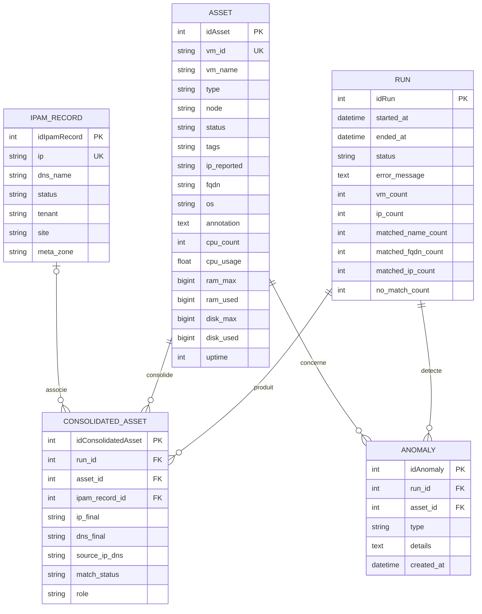
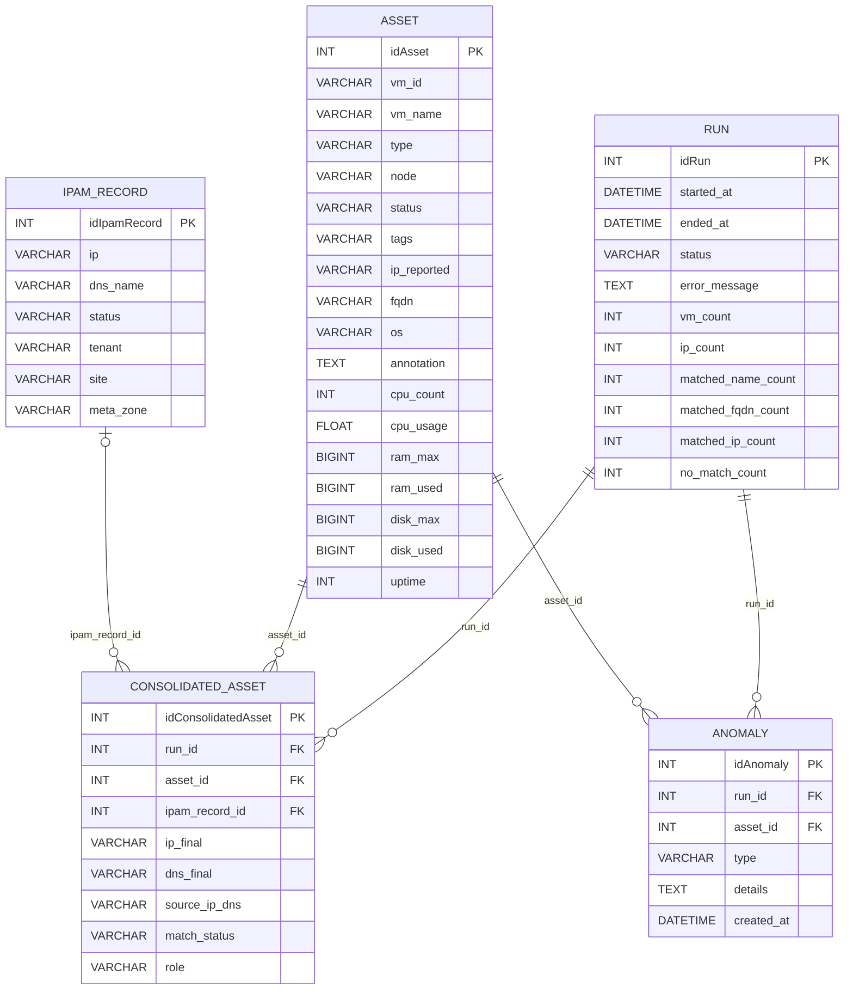
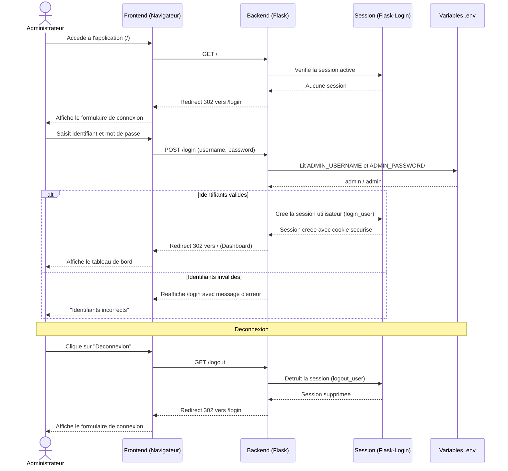
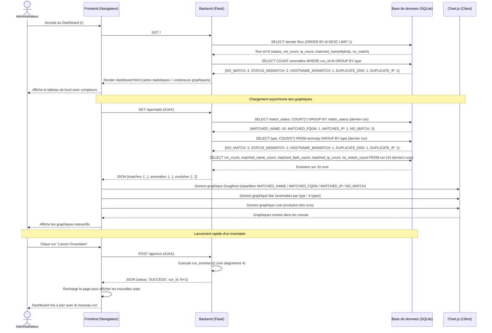
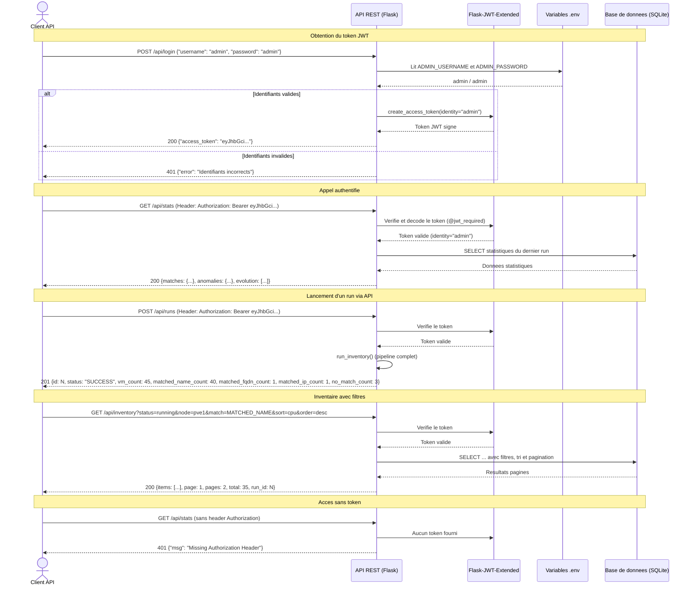

# Diagrammes CloudInventory v2.0
# Pour rendre les diagrammes : coller le code Mermaid dans https://mermaid.live ou dans un outil compatible

---

## 1. MODELE CONCEPTUEL DE DONNEES (MCD / MEA - Merise)

### Entites et attributs

```
+============================+     +============================+     +========================+
|           RUN              |     |          ASSET             |     |     IPAM_RECORD        |
+============================+     +============================+     +========================+
| #idRun             INT     |     | #idAsset           INT     |     | #idIpamRecord    INT   |
| started_at     DATETIME    |     | vm_id           STRING     |     | ip            STRING   |
| ended_at       DATETIME    |     | vm_name         STRING     |     | dns_name      STRING   |
| status           STRING    |     | type            STRING     |     | status        STRING   |
| error_message      TEXT    |     | node            STRING     |     | tenant        STRING   |
| vm_count            INT    |     | status          STRING     |     | site          STRING   |
| ip_count            INT    |     | tags            STRING     |     | meta_zone     STRING   |
| matched_name_count  INT    |     | ip_reported     STRING     |     +========================+
| matched_fqdn_count  INT    |     | fqdn            STRING     |
| matched_ip_count    INT    |     | os              STRING     |
| no_match_count      INT    |     | annotation        TEXT     |
+============================+     | cpu_count          INT     |
                                   | cpu_usage        FLOAT     |
+========================+         | ram_max         BIGINT     |
|       ANOMALY          |         | ram_used        BIGINT     |
+========================+         | disk_max        BIGINT     |
| #idAnomaly       INT   |         | disk_used       BIGINT     |
| type          STRING   |         | uptime             INT     |
| details          TEXT  |         +============================+
| created_at  DATETIME   |
+========================+         +==============================+
                                   |    CONSOLIDATED_ASSET        |
                                   +==============================+
                                   | #idConsolidatedAsset   INT   |
                                   | ip_final            STRING   |
                                   | dns_final           STRING   |
                                   | source_ip_dns       STRING   |
                                   | match_status        STRING   |
                                   | role                STRING   |
                                   +==============================+
```

### Associations et cardinalites

```
PRODUIRE
    RUN (1,1) ----------- (0,n) CONSOLIDATED_ASSET
    Un run produit plusieurs assets consolides.
    Un asset consolide appartient a un seul run.

CONSOLIDER
    ASSET (1,1) ----------- (0,n) CONSOLIDATED_ASSET
    Chaque consolidation concerne un seul asset.
    Un asset peut apparaitre dans plusieurs consolidations (une par run).

ASSOCIER
    IPAM_RECORD (0,1) ----------- (0,n) CONSOLIDATED_ASSET
    Une consolidation peut avoir zero ou un enregistrement IPAM (nullable).
    Un enregistrement IPAM peut etre associe a plusieurs consolidations.

DETECTER
    RUN (1,1) ----------- (0,n) ANOMALY
    Un run peut detecter plusieurs anomalies.
    Chaque anomalie est liee a un seul run.

CONCERNER
    ASSET (1,1) ----------- (0,n) ANOMALY
    Une anomalie concerne un seul asset.
    Un asset peut etre concerne par plusieurs anomalies.
```

### Diagramme MCD (Mermaid erDiagram)



---

## 2. MODELE LOGIQUE DE DONNEES (MLD / Schema relationnel)

### Passage MCD vers MLD (regles appliquees)

- Chaque entite devient une table
- Les associations (1,1)-(0,n) sont implementees par cle etrangere cote (1,1)
- L'association (0,1)-(0,n) est implementee par cle etrangere nullable

### Schema relationnel

```
RUN (
    #idRun INT PRIMARY KEY AUTO_INCREMENT,
    started_at DATETIME NOT NULL DEFAULT CURRENT_TIMESTAMP,
    ended_at DATETIME,
    status VARCHAR(20) NOT NULL DEFAULT 'RUNNING',  -- 'RUNNING' | 'SUCCESS' | 'FAIL'
    error_message TEXT,
    vm_count INT DEFAULT 0,
    ip_count INT DEFAULT 0,
    matched_name_count INT DEFAULT 0,
    matched_fqdn_count INT DEFAULT 0,
    matched_ip_count INT DEFAULT 0,
    no_match_count INT DEFAULT 0
)

ASSET (
    #idAsset INT PRIMARY KEY AUTO_INCREMENT,
    vm_id VARCHAR(50) NOT NULL,
    vm_name VARCHAR(100) NOT NULL,
    type VARCHAR(20),                           -- 'qemu' | 'lxc'
    node VARCHAR(100),                          -- 'pve1'..'pve5'
    status VARCHAR(20),                         -- 'running' | 'stopped'
    tags VARCHAR(200),
    ip_reported VARCHAR(45),
    fqdn VARCHAR(255),                          -- Nom de domaine complet
    os VARCHAR(100),                            -- Systeme d'exploitation
    annotation TEXT,                            -- Note descriptive
    cpu_count INT,
    cpu_usage FLOAT,
    ram_max BIGINT,
    ram_used BIGINT,
    disk_max BIGINT,
    disk_used BIGINT,
    uptime INT
)

IPAM_RECORD (
    #idIpamRecord INT PRIMARY KEY AUTO_INCREMENT,
    ip VARCHAR(45) NOT NULL,
    dns_name VARCHAR(200),
    status VARCHAR(50),                         -- 'active' | 'reserved' | 'deprecated'
    tenant VARCHAR(100),
    site VARCHAR(100),
    meta_zone VARCHAR(100)                      -- Zone reseau : 'ZM' | 'ZCS' | 'ZE'
)

CONSOLIDATED_ASSET (
    #idConsolidatedAsset INT PRIMARY KEY AUTO_INCREMENT,
    run_id INT NOT NULL,                        -- FK -> RUN(idRun)
    asset_id INT NOT NULL,                      -- FK -> ASSET(idAsset)
    ipam_record_id INT,                         -- FK -> IPAM_RECORD(idIpamRecord) -- nullable
    ip_final VARCHAR(45),
    dns_final VARCHAR(200),
    source_ip_dns VARCHAR(20) NOT NULL,         -- 'NETBOX' | 'VIRT'
    match_status VARCHAR(30) NOT NULL,          -- 'MATCHED_NAME' | 'MATCHED_FQDN' | 'MATCHED_IP' | 'NO_MATCH'
    role VARCHAR(50) DEFAULT 'Indetermine',
    FOREIGN KEY (run_id) REFERENCES RUN(idRun),
    FOREIGN KEY (asset_id) REFERENCES ASSET(idAsset),
    FOREIGN KEY (ipam_record_id) REFERENCES IPAM_RECORD(idIpamRecord)
)

ANOMALY (
    #idAnomaly INT PRIMARY KEY AUTO_INCREMENT,
    run_id INT NOT NULL,                        -- FK -> RUN(idRun)
    asset_id INT NOT NULL,                      -- FK -> ASSET(idAsset)
    type VARCHAR(50) NOT NULL,                  -- 'NO_MATCH' | 'HOSTNAME_MISMATCH' | 'STATUS_MISMATCH' | 'DUPLICATE_DNS' | 'DUPLICATE_IP'
    details TEXT,
    created_at DATETIME DEFAULT CURRENT_TIMESTAMP,
    FOREIGN KEY (run_id) REFERENCES RUN(idRun),
    FOREIGN KEY (asset_id) REFERENCES ASSET(idAsset)
)
```

### Diagramme du schema relationnel (Mermaid)



---

## 3. DIAGRAMME DE SEQUENCE UML -- Authentification



---

## 4. DIAGRAMME DE SEQUENCE UML -- Lancement d'un cycle d'inventaire (Run)

```mermaid
sequenceDiagram
    actor Admin as Administrateur
    participant F as Frontend (Navigateur)
    participant B as Backend (Flask)
    participant R as InventoryRunner
    participant SRC as Source Virt (Mock/Proxmox)
    participant IPAM as Source IPAM (Mock/NetBox)
    participant DB as Base de donnees (SQLite)

    Admin->>F: Clique sur "Lancer l'inventaire"
    F->>B: POST /ajax/run (AJAX)

    rect rgb(40, 40, 80)
        Note over B, DB: Etape 1 - Initialisation du Run
        B->>R: run_inventory()
        R->>DB: INSERT Run (status='RUNNING', started_at=now)
        DB-->>R: Run cree (id=N)
    end

    rect rgb(40, 80, 40)
        Note over R, SRC: Etape 2 - Collecte Virtualisation (USE_MOCK_VIRT)
        R->>SRC: fetch_mock_vms() ou fetch_proxmox_vms()
        SRC-->>R: Liste de 45 VM/CT (vm_id, vm_name, type, node, status, fqdn, os, annotation, tags, metriques)
    end

    rect rgb(40, 80, 40)
        Note over R, IPAM: Etape 3 - Collecte IPAM/DNS (USE_MOCK_IPAM)
        R->>IPAM: fetch_mock_ipam() ou fetch_ipam_records()
        IPAM-->>R: Liste de 44 enregistrements IP/DNS (ip, dns_name, status, tenant, site, meta_zone)
    end

    rect rgb(80, 40, 40)
        Note over R, DB: Etape 4 - Upsert des donnees
        R->>DB: Pour chaque VM : INSERT ou UPDATE Asset (par vm_id)
        R->>DB: Pour chaque IP : INSERT ou UPDATE IpamRecord (par ip + dns_name)
        DB-->>R: Assets et IpamRecords a jour
    end

    rect rgb(80, 60, 20)
        Note over R, DB: Etape 5 - Consolidation multi-strategie + deduction de role
        R->>R: Construit index DNS (hostname normalise) et index IP
        loop Pour chaque Asset
            R->>R: Deduit le role fonctionnel (lettre+chiffres ou tag role:xxx)
            alt Strategie 1 : hostname normalise == dns_name
                R->>DB: INSERT ConsolidatedAsset (match_status='MATCHED_NAME', source='NETBOX')
                alt VM stopped + IP active dans NetBox
                    R->>DB: INSERT Anomaly (type='STATUS_MISMATCH')
                end
            else Strategie 2 : premier segment FQDN == dns_name
                R->>DB: INSERT ConsolidatedAsset (match_status='MATCHED_FQDN', source='NETBOX')
            else Strategie 3 : IP reportee == IP NetBox
                R->>DB: INSERT ConsolidatedAsset (match_status='MATCHED_IP', source='NETBOX')
                R->>DB: INSERT Anomaly (type='HOSTNAME_MISMATCH')
            else Strategie 4 : aucune correspondance
                R->>DB: INSERT ConsolidatedAsset (match_status='NO_MATCH', source='VIRT')
                R->>DB: INSERT Anomaly (type='NO_MATCH')
            end
        end
    end

    rect rgb(80, 20, 20)
        Note over R, DB: Etape 6 - Detection anomalies IPAM (doublons)
        R->>R: Compte les dns_name en doublon
        R->>DB: INSERT Anomaly (type='DUPLICATE_DNS') pour chaque doublon
        R->>R: Compte les IP en doublon
        R->>DB: INSERT Anomaly (type='DUPLICATE_IP') pour chaque doublon
    end

    rect rgb(40, 40, 80)
        Note over R, DB: Etape 7 - Finalisation
        R->>DB: UPDATE Run (status='SUCCESS', ended_at=now, vm_count, ip_count, matched_name/fqdn/ip_count, no_match_count)
        DB-->>R: Run finalise
    end

    R-->>B: Retourne le Run avec statistiques
    B-->>F: JSON {status: 'SUCCESS', run_id: N, vm_count: 45, matched_name: 40, matched_fqdn: 1, matched_ip: 1, no_match: 3}
    F-->>Admin: Affiche les resultats et redirige vers le detail du run
```



---

## 5. DIAGRAMME DE SEQUENCE UML -- Consultation de l'inventaire avec filtres

```mermaid
sequenceDiagram
    actor Admin as Administrateur
    participant F as Frontend (Navigateur)
    participant B as Backend (Flask)
    participant DB as Base de donnees (SQLite)

    Admin->>F: Accede a la page Inventaire
    F->>B: GET /inventory

    B->>DB: SELECT dernier Run (ORDER BY id DESC LIMIT 1)
    DB-->>B: Run id=N

    B->>DB: SELECT ConsolidatedAsset JOIN Asset JOIN IpamRecord WHERE run_id=N (LIMIT 25, page 1)
    DB-->>B: 25 premiers assets consolides

    B-->>F: Render inventory.html (tableau + filtres + pagination)
    F-->>Admin: Affiche l'inventaire consolide

    Note over Admin, DB: Application de filtres

    Admin->>F: Selectionne status="running", node="pve1", match="MATCHED_NAME", recherche "web"
    F->>B: GET /inventory?status=running&node=pve1&match=MATCHED_NAME&q=web

    B->>DB: SELECT ... WHERE status='running' AND node='pve1' AND match_status='MATCHED_NAME' AND (vm_name LIKE '%web%' OR ip_final LIKE '%web%' OR dns_final LIKE '%web%')
    DB-->>B: Resultats filtres

    B-->>F: Render inventory.html (resultats filtres)
    F-->>Admin: Affiche les resultats filtres

    Note over Admin, DB: Tri par colonne

    Admin->>F: Clique sur l'en-tete "CPU" pour trier
    F->>B: GET /inventory?sort=cpu&order=desc
    B->>DB: SELECT ... ORDER BY cpu_usage DESC
    DB-->>B: Resultats tries
    B-->>F: Render inventory.html
    F-->>Admin: Affiche l'inventaire trie par CPU decroissant

    Note over Admin, DB: Export CSV

    Admin->>F: Clique sur "Exporter CSV"
    F->>B: GET /inventory/export
    B->>DB: SELECT tous les ConsolidatedAssets du dernier run (sans pagination)
    DB-->>B: Tous les assets
    B->>B: Genere le fichier CSV (separateur point-virgule)
    B-->>F: Reponse avec Content-Disposition: attachment; filename=inventaire_runN.csv
    F-->>Admin: Telecharge le fichier CSV

    Note over Admin, DB: Recherche AJAX temps reel

    Admin->>F: Tape "db-" dans le champ de recherche
    F->>B: GET /ajax/inventory/search?q=db-
    B->>DB: SELECT ... WHERE vm_name LIKE '%db-%' (LIMIT 100)
    DB-->>B: Resultats
    B-->>F: JSON [{vm_name, status, ip, dns, match_status, role, ...}]
    F-->>Admin: Met a jour le tableau en temps reel
```

---

## 6. DIAGRAMME DE SEQUENCE UML -- Comparaison de deux runs


---

## 7. DIAGRAMME DE SEQUENCE UML -- Detection et consultation des anomalies

```mermaid
sequenceDiagram
    actor Admin as Administrateur
    participant F as Frontend (Navigateur)
    participant B as Backend (Flask)
    participant R as InventoryRunner
    participant DB as Base de donnees (SQLite)

    Note over R, DB: Pendant l'execution d'un Run (automatique)

    rect rgb(80, 20, 20)
        Note over R, DB: Detection NO_MATCH (Strategie 4)
        R->>R: VM "temp-migration" : aucune correspondance (ni hostname, ni FQDN, ni IP)
        R->>DB: INSERT Anomaly (type='NO_MATCH', details='Aucune correspondance NetBox (hostname, FQDN ni IP)')
    end

    rect rgb(80, 40, 20)
        Note over R, DB: Detection HOSTNAME_MISMATCH (Strategie 3 - match par IP)
        R->>R: VM "ghost-vm" matchee par IP 10.0.9.98 mais hostname != DNS NetBox "old-printer"
        R->>DB: INSERT Anomaly (type='HOSTNAME_MISMATCH', details='VM ghost-vm matchee par IP mais hostname != DNS old-printer')
    end

    rect rgb(80, 50, 10)
        Note over R, DB: Detection STATUS_MISMATCH (Strategie 1 - match par hostname)
        R->>R: VM "backup-srv" est stopped mais IP 10.0.2.16 est "active" dans NetBox
        R->>DB: INSERT Anomaly (type='STATUS_MISMATCH', details='VM stopped mais IP active dans NetBox')
    end

    rect rgb(80, 20, 40)
        Note over R, DB: Detection DUPLICATE_DNS (post-consolidation)
        R->>R: dns_name "monitoring" apparait 2 fois dans NetBox (10.0.4.10 et 10.0.8.50)
        R->>DB: INSERT Anomaly (type='DUPLICATE_DNS', details='DNS monitoring present 2 fois dans NetBox')
    end

    rect rgb(60, 20, 60)
        Note over R, DB: Detection DUPLICATE_IP (post-consolidation)
        R->>R: IP "10.0.4.16" apparait 2 fois dans NetBox (gitea-repo et gitea-mirror)
        R->>DB: INSERT Anomaly (type='DUPLICATE_IP', details='IP 10.0.4.16 presente 2 fois dans NetBox')
    end

    Note over Admin, DB: Consultation des anomalies

    Admin->>F: Accede a la page Anomalies
    F->>B: GET /anomalies
    B->>DB: SELECT Anomaly JOIN Run JOIN Asset (pagine 25/page)
    DB-->>B: Liste des anomalies
    B-->>F: Render anomalies.html (tableau avec type, details, run, asset, date)
    F-->>Admin: Affiche toutes les anomalies

    Admin->>F: Filtre par type "HOSTNAME_MISMATCH"
    F->>B: GET /anomalies?type=HOSTNAME_MISMATCH
    B->>DB: SELECT ... WHERE type='HOSTNAME_MISMATCH'
    DB-->>B: Anomalies filtrees
    B-->>F: Render anomalies.html (resultats filtres)
    F-->>Admin: Affiche uniquement les divergences hostname/DNS

    Admin->>F: Clique sur une anomalie pour voir l'asset concerne
    F->>B: GET /assets/15
    B->>DB: SELECT Asset, ConsolidatedAssets, Anomalies WHERE asset_id=15
    DB-->>B: Detail complet de la VM (metriques, FQDN, OS, historique, anomalies)
    B-->>F: Render asset_detail.html
    F-->>Admin: Affiche la VM avec son historique et ses anomalies
```



---

## 8. DIAGRAMME DE SEQUENCE UML -- Dashboard et statistiques



---

## 9. DIAGRAMME DE SEQUENCE UML -- API REST avec authentification JWT



---

## RESUME DES DIAGRAMMES

| N. | Type | Description |
|----|------|-------------|
| 1 | MCD (Merise) | Modele Conceptuel de Donnees - 5 entites, 5 associations |
| 2 | MLD / Schema relationnel | Modele Logique de Donnees - Tables SQL avec FK |
| 3 | Sequence UML | Authentification web (login / logout via Flask-Login) |
| 4 | Sequence UML | Lancement d'un cycle d'inventaire (pipeline 7 etapes, matching multi-strategie) |
| 5 | Sequence UML | Consultation de l'inventaire avec filtres, tri, export CSV, recherche AJAX |
| 6 | Sequence UML | Comparaison de deux runs (ajouts, suppressions, modifications) |
| 7 | Sequence UML | Detection et consultation des anomalies (6 types) |
| 8 | Sequence UML | Dashboard et statistiques (Chart.js, API stats) |
| 9 | Sequence UML | API REST avec authentification JWT (login, endpoints proteges, filtres) |

---

## COMMENT GENERER LES IMAGES

1. **Mermaid Live Editor** : Copier chaque bloc ```mermaid dans https://mermaid.live puis exporter en PNG/SVG
2. **VS Code** : Installer l'extension "Markdown Preview Mermaid Support" pour previsualiser
3. **Draw.io / diagrams.net** : Importer le Mermaid via Extras > Mermaid
4. **Notion** : Coller le code Mermaid dans un bloc code de type "mermaid"
