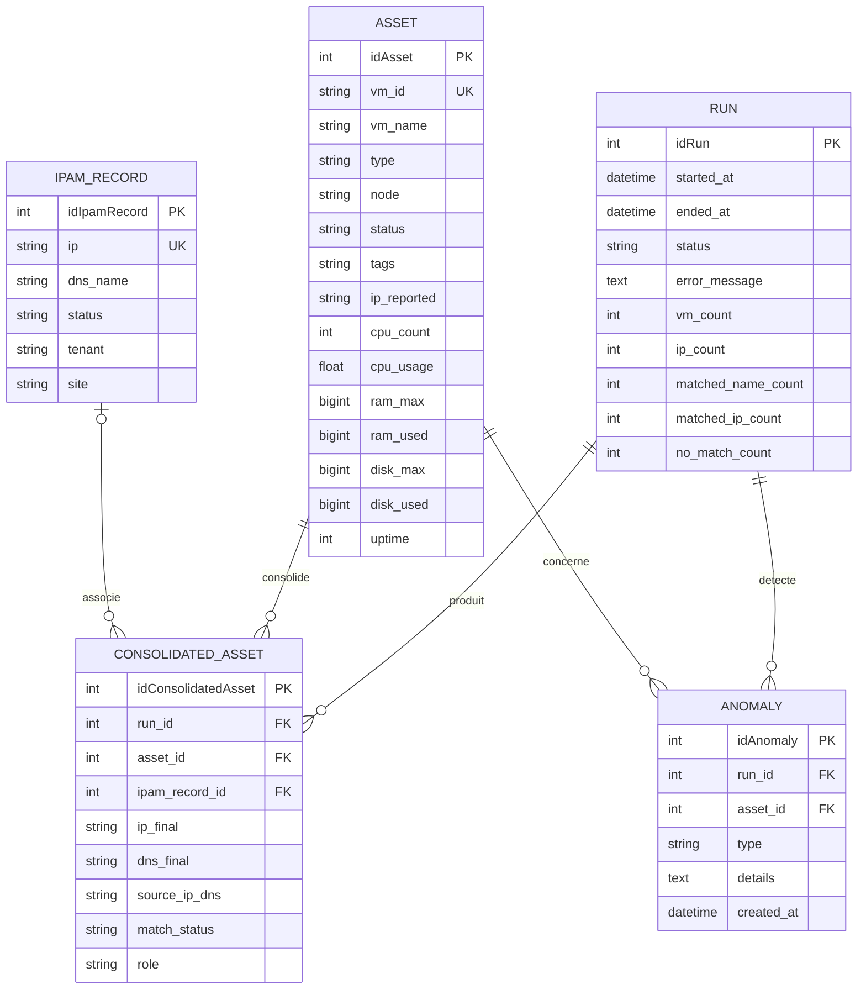
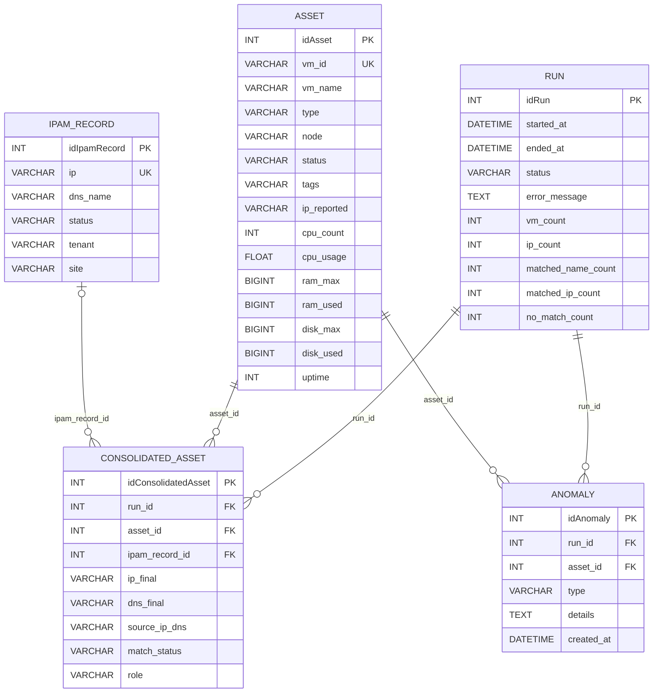
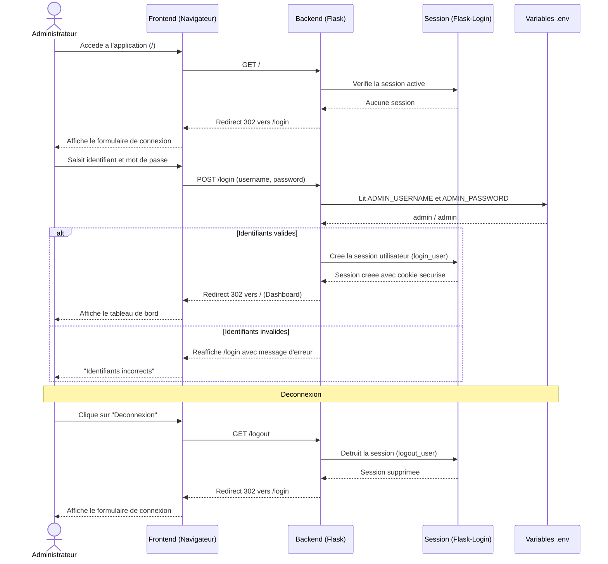
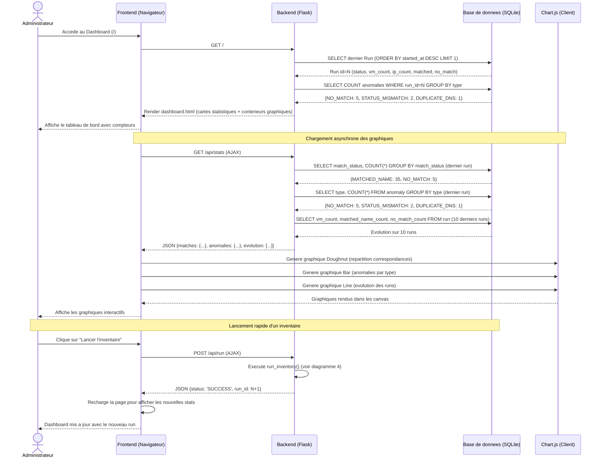

# Diagrammes CloudInventory
# Pour rendre les diagrammes : coller le code Mermaid dans https://mermaid.live ou dans un outil compatible

---

## 1. MODELE CONCEPTUEL DE DONNEES (MCD / MEA - Merise)

### Entites et attributs

```
+========================+     +========================+     +========================+
|         RUN            |     |         ASSET          |     |     IPAM_RECORD        |
+========================+     +========================+     +========================+
| #idRun           INT   |     | #idAsset         INT   |     | #idIpamRecord    INT   |
| started_at   DATETIME  |     | vm_id         STRING   |     | ip            STRING   |
| ended_at     DATETIME  |     | vm_name       STRING   |     | dns_name      STRING   |
| status         STRING  |     | type          STRING   |     | status        STRING   |
| error_message    TEXT  |     | node          STRING   |     | tenant        STRING   |
| vm_count          INT  |     | status        STRING   |     | site          STRING   |
| ip_count          INT  |     | tags          STRING   |     +========================+
| matched_name_count INT |     | ip_reported   STRING   |
| matched_ip_count   INT |     | cpu_count        INT   |
| no_match_count     INT |     | cpu_usage      FLOAT   |
+========================+     | ram_max       BIGINT   |
                               | ram_used      BIGINT   |
+========================+     | disk_max      BIGINT   |
|       ANOMALY          |     | disk_used     BIGINT   |
+========================+     | uptime           INT   |
| #idAnomaly       INT   |     +========================+
| type          STRING   |
| details          TEXT  |     +==============================+
| created_at  DATETIME   |     |    CONSOLIDATED_ASSET        |
+========================+     +==============================+
                               | #idConsolidatedAsset   INT   |
                               | ip_final            STRING   |
                               | dns_final           STRING   |
                               | source_ip_dns       STRING   |
                               | match_status        STRING   |
                               | role                STRING   |
                               +==============================+
```

### Associations et cardinalites

```
PRODUIRE
    RUN (1,1) ----------- (0,n) CONSOLIDATED_ASSET
    Un run produit plusieurs assets consolides.
    Un asset consolide appartient a un seul run.

CONSOLIDER
    ASSET (1,1) ----------- (0,n) CONSOLIDATED_ASSET
    Chaque consolidation concerne un seul asset.
    Un asset peut apparaitre dans plusieurs consolidations (une par run).

ASSOCIER
    IPAM_RECORD (0,1) ----------- (0,n) CONSOLIDATED_ASSET
    Une consolidation peut avoir zero ou un enregistrement IPAM (nullable).
    Un enregistrement IPAM peut etre associe a plusieurs consolidations.

DETECTER
    RUN (1,1) ----------- (0,n) ANOMALY
    Un run peut detecter plusieurs anomalies.
    Chaque anomalie est liee a un seul run.

CONCERNER
    ASSET (1,1) ----------- (0,n) ANOMALY
    Une anomalie concerne un seul asset.
    Un asset peut etre concerne par plusieurs anomalies.
```

### Diagramme MCD (Mermaid erDiagram)



---

## 2. MODELE LOGIQUE DE DONNEES (MLD / Schema relationnel)

### Passage MCD vers MLD (regles appliquees)

- Chaque entite devient une table
- Les associations (1,1)-(0,n) sont implementees par cle etrangere cote (1,1)
- L'association (0,1)-(0,n) est implementee par cle etrangere nullable

### Schema relationnel

```
RUN (
    #idRun INT PRIMARY KEY AUTO_INCREMENT,
    started_at DATETIME NOT NULL,
    ended_at DATETIME,
    status VARCHAR(20) NOT NULL,         -- 'RUNNING' | 'SUCCESS' | 'FAIL'
    error_message TEXT,
    vm_count INT DEFAULT 0,
    ip_count INT DEFAULT 0,
    matched_name_count INT DEFAULT 0,
    matched_ip_count INT DEFAULT 0,
    no_match_count INT DEFAULT 0
)

ASSET (
    #idAsset INT PRIMARY KEY AUTO_INCREMENT,
    vm_id VARCHAR(50) UNIQUE NOT NULL,
    vm_name VARCHAR(100) NOT NULL,
    type VARCHAR(10) NOT NULL,           -- 'qemu' | 'lxc'
    node VARCHAR(50) NOT NULL,           -- 'pve1'..'pve5'
    status VARCHAR(20) NOT NULL,         -- 'running' | 'stopped'
    tags VARCHAR(500),
    ip_reported VARCHAR(45),
    cpu_count INT,
    cpu_usage FLOAT,
    ram_max BIGINT,
    ram_used BIGINT,
    disk_max BIGINT,
    disk_used BIGINT,
    uptime INT
)

IPAM_RECORD (
    #idIpamRecord INT PRIMARY KEY AUTO_INCREMENT,
    ip VARCHAR(45) UNIQUE NOT NULL,
    dns_name VARCHAR(255),
    status VARCHAR(20),                  -- 'active' | 'reserved' | 'deprecated'
    tenant VARCHAR(100),
    site VARCHAR(100)
)

CONSOLIDATED_ASSET (
    #idConsolidatedAsset INT PRIMARY KEY AUTO_INCREMENT,
    run_id INT NOT NULL,                 -- FK -> RUN(idRun)
    asset_id INT NOT NULL,               -- FK -> ASSET(idAsset)
    ipam_record_id INT,                  -- FK -> IPAM_RECORD(idIpamRecord) -- nullable
    ip_final VARCHAR(45),
    dns_final VARCHAR(255),
    source_ip_dns VARCHAR(10) NOT NULL,  -- 'NETBOX' | 'VIRT'
    match_status VARCHAR(20) NOT NULL,   -- 'MATCHED_NAME' | 'MATCHED_IP' | 'NO_MATCH'
    role VARCHAR(50) DEFAULT 'Indetermine',
    FOREIGN KEY (run_id) REFERENCES RUN(idRun),
    FOREIGN KEY (asset_id) REFERENCES ASSET(idAsset),
    FOREIGN KEY (ipam_record_id) REFERENCES IPAM_RECORD(idIpamRecord)
)

ANOMALY (
    #idAnomaly INT PRIMARY KEY AUTO_INCREMENT,
    run_id INT NOT NULL,                 -- FK -> RUN(idRun)
    asset_id INT NOT NULL,               -- FK -> ASSET(idAsset)
    type VARCHAR(30) NOT NULL,           -- 'NO_MATCH' | 'STATUS_MISMATCH' | 'DUPLICATE_DNS' | 'DUPLICATE_IP'
    details TEXT NOT NULL,
    created_at DATETIME DEFAULT CURRENT_TIMESTAMP,
    FOREIGN KEY (run_id) REFERENCES RUN(idRun),
    FOREIGN KEY (asset_id) REFERENCES ASSET(idAsset)
)
```

### Diagramme du schema relationnel (Mermaid)



---

## 3. DIAGRAMME DE SEQUENCE UML -- Authentification



---

## 4. DIAGRAMME DE SEQUENCE UML -- Lancement d'un cycle d'inventaire (Run)

```mermaid
sequenceDiagram
    actor Admin as Administrateur
    participant F as Frontend (Navigateur)
    participant B as Backend (Flask)
    participant R as InventoryRunner
    participant MV as Mock Virtualisation
    participant NB as NetBox API / Mock IPAM
    participant DB as Base de donnees (SQLite)

    Admin->>F: Clique sur "Lancer l'inventaire"
    F->>B: POST /api/run (AJAX)

    rect rgb(40, 40, 80)
        Note over B, DB: Etape 1 - Initialisation du Run
        B->>R: run_inventory()
        R->>DB: INSERT Run (status='RUNNING', started_at=now)
        DB-->>R: Run cree (id=N)
    end

    rect rgb(40, 80, 40)
        Note over R, MV: Etape 2 - Collecte Virtualisation
        R->>MV: fetch_mock_vms()
        MV-->>R: Liste de 40 VM/CT (vm_id, vm_name, type, node, status, metriques, tags)
    end

    rect rgb(40, 80, 40)
        Note over R, NB: Etape 3 - Collecte IPAM/DNS
        R->>NB: fetch_ipam_records() ou fetch_mock_ipam()
        NB-->>R: Liste de 40 enregistrements IP/DNS (ip, dns_name, status, tenant, site)
    end

    rect rgb(80, 40, 40)
        Note over R, DB: Etape 4 - Upsert des donnees
        R->>DB: Pour chaque VM : INSERT ou UPDATE Asset (par vm_id unique)
        R->>DB: Pour chaque IP : INSERT ou UPDATE IpamRecord (par ip unique)
        DB-->>R: Assets et IpamRecords a jour
    end

    rect rgb(80, 60, 20)
        Note over R, DB: Etape 5 - Consolidation
        R->>R: Construit un index dns_name (case-insensitive) des IpamRecords
        loop Pour chaque Asset
            R->>R: Cherche correspondance vm_name == dns_name
            alt Correspondance trouvee
                R->>DB: INSERT ConsolidatedAsset (match_status='MATCHED_NAME', source='NETBOX')
                alt VM stopped + IP active
                    R->>DB: INSERT Anomaly (type='STATUS_MISMATCH')
                end
            else Aucune correspondance
                R->>DB: INSERT ConsolidatedAsset (match_status='NO_MATCH', source='VIRT')
                R->>DB: INSERT Anomaly (type='NO_MATCH')
            end
        end
    end

    rect rgb(80, 20, 20)
        Note over R, DB: Etape 6 - Detection anomalies IPAM
        R->>R: Compte les dns_name en doublon
        R->>DB: INSERT Anomaly (type='DUPLICATE_DNS') pour chaque doublon
        R->>R: Compte les IP en doublon
        R->>DB: INSERT Anomaly (type='DUPLICATE_IP') pour chaque doublon
    end

    R->>DB: UPDATE Run (status='SUCCESS', ended_at=now, vm_count, ip_count, matched_count, no_match_count)
    DB-->>R: Run finalise

    R-->>B: Retourne le Run avec statistiques
    B-->>F: JSON {status: 'SUCCESS', run_id: N, vm_count: 40, ...}
    F-->>Admin: Affiche les resultats et redirige vers le detail du run
```



---

## 5. DIAGRAMME DE SEQUENCE UML -- Consultation de l'inventaire avec filtres

```mermaid
sequenceDiagram
    actor Admin as Administrateur
    participant F as Frontend (Navigateur)
    participant B as Backend (Flask)
    participant DB as Base de donnees (SQLite)

    Admin->>F: Accede a la page Inventaire
    F->>B: GET /inventory

    B->>DB: SELECT dernier Run (ORDER BY started_at DESC LIMIT 1)
    DB-->>B: Run id=N

    B->>DB: SELECT ConsolidatedAsset JOIN Asset JOIN IpamRecord WHERE run_id=N (LIMIT 25, page 1)
    DB-->>B: 25 premiers assets consolides

    B->>DB: SELECT DISTINCT node, type, tag FROM Asset (pour les filtres)
    DB-->>B: Listes de valeurs pour les dropdowns

    B-->>F: Render inventory.html (tableau + filtres + pagination)
    F-->>Admin: Affiche l'inventaire consolide

    Note over Admin, DB: Application de filtres

    Admin->>F: Selectionne status="running", node="pve1", recherche "web"
    F->>B: GET /inventory?status=running&node=pve1&q=web

    B->>DB: SELECT ... WHERE status='running' AND node='pve1' AND (vm_name ILIKE '%web%' OR ip_final ILIKE '%web%' OR dns_final ILIKE '%web%')
    DB-->>B: Resultats filtres

    B-->>F: Render inventory.html (resultats filtres)
    F-->>Admin: Affiche les resultats filtres

    Note over Admin, DB: Export CSV

    Admin->>F: Clique sur "Exporter CSV"
    F->>B: GET /inventory/export
    B->>DB: SELECT tous les ConsolidatedAssets du dernier run (sans pagination)
    DB-->>B: Tous les assets
    B->>B: Genere le fichier CSV (separateur point-virgule)
    B-->>F: Reponse avec Content-Disposition: attachment; filename=inventaire_runN.csv
    F-->>Admin: Telecharge le fichier CSV

    Note over Admin, DB: Recherche AJAX temps reel

    Admin->>F: Tape "db-" dans le champ de recherche
    F->>B: GET /api/inventory/search?q=db-
    B->>DB: SELECT ... WHERE vm_name ILIKE '%db-%' (LIMIT 100)
    DB-->>B: Resultats
    B-->>F: JSON [{vm_name, status, ip, dns, match_status, ...}]
    F-->>Admin: Met a jour le tableau en temps reel
```

---

## 6. DIAGRAMME DE SEQUENCE UML -- Comparaison de deux runs

```mermaid
sequenceDiagram
    actor Admin as Administrateur
    participant F as Frontend (Navigateur)
    participant B as Backend (Flask)
    participant DB as Base de donnees (SQLite)

    Admin->>F: Accede a la page Runs
    F->>B: GET /runs
    B->>DB: SELECT tous les Runs (pagines 25/page)
    DB-->>B: Liste des runs
    B-->>F: Render runs.html
    F-->>Admin: Affiche l'historique des runs

    Admin->>F: Selectionne Run #5 et Run #8 pour comparaison
    F->>B: GET /runs/compare?run1=5&run2=8

    rect rgb(40, 40, 80)
        Note over B, DB: Chargement des deux runs
        B->>DB: SELECT ConsolidatedAsset JOIN Asset JOIN IpamRecord WHERE run_id=5
        DB-->>B: Assets du Run #5 (dict par vm_name)
        B->>DB: SELECT ConsolidatedAsset JOIN Asset JOIN IpamRecord WHERE run_id=8
        DB-->>B: Assets du Run #8 (dict par vm_name)
    end

    rect rgb(80, 60, 20)
        Note over B, B: Analyse des differences
        B->>B: VMs AJOUTEES = (noms dans Run8) - (noms dans Run5)
        B->>B: VMs SUPPRIMEES = (noms dans Run5) - (noms dans Run8)
        B->>B: VMs MODIFIEES = noms communs avec delta (IP, DNS, match_status, status)
    end

    B-->>F: Render run_compare.html (tableaux colores : vert=ajoute, rouge=supprime, orange=modifie)
    F-->>Admin: Affiche la comparaison cote a cote

    Admin->>F: Consulte les details d'une VM modifiee
    F->>B: GET /assets/42
    B->>DB: SELECT Asset WHERE id=42
    B->>DB: SELECT ConsolidatedAsset WHERE asset_id=42 (30 derniers runs)
    B->>DB: SELECT Anomaly WHERE asset_id=42 (chronologie)
    DB-->>B: Historique complet de la VM
    B-->>F: Render asset_detail.html
    F-->>Admin: Affiche le detail de la VM avec son historique
```



---

## 7. DIAGRAMME DE SEQUENCE UML -- Detection et consultation des anomalies

```mermaid
sequenceDiagram
    actor Admin as Administrateur
    participant F as Frontend (Navigateur)
    participant B as Backend (Flask)
    participant R as InventoryRunner
    participant DB as Base de donnees (SQLite)

    Note over R, DB: Pendant l'execution d'un Run (automatique)

    rect rgb(80, 20, 20)
        Note over R, DB: Detection NO_MATCH
        R->>R: VM "orphan-999" n'a aucune correspondance DNS dans NetBox
        R->>DB: INSERT Anomaly (type='NO_MATCH', details='VM orphan-999 : aucun enregistrement DNS dans NetBox')
    end

    rect rgb(80, 40, 20)
        Note over R, DB: Detection STATUS_MISMATCH
        R->>R: VM "web-a500" est stopped mais IP 10.0.0.10 est "active" dans NetBox
        R->>DB: INSERT Anomaly (type='STATUS_MISMATCH', details='VM stopped mais IP active dans NetBox')
    end

    rect rgb(80, 20, 40)
        Note over R, DB: Detection DUPLICATE_DNS
        R->>R: dns_name "db-b500" apparait 2 fois dans NetBox
        R->>DB: INSERT Anomaly (type='DUPLICATE_DNS', details='DNS db-b500 present 2 fois dans NetBox')
    end

    rect rgb(60, 20, 60)
        Note over R, DB: Detection DUPLICATE_IP
        R->>R: IP "10.0.0.15" apparait 2 fois dans NetBox
        R->>DB: INSERT Anomaly (type='DUPLICATE_IP', details='IP 10.0.0.15 presente 2 fois dans NetBox')
    end

    Note over Admin, DB: Consultation des anomalies

    Admin->>F: Accede a la page Anomalies
    F->>B: GET /anomalies
    B->>DB: SELECT Anomaly JOIN Run JOIN Asset (pagine 25/page)
    DB-->>B: Liste des anomalies
    B-->>F: Render anomalies.html (tableau avec type, details, run, asset, date)
    F-->>Admin: Affiche toutes les anomalies

    Admin->>F: Filtre par type "STATUS_MISMATCH"
    F->>B: GET /anomalies?type=STATUS_MISMATCH
    B->>DB: SELECT ... WHERE type='STATUS_MISMATCH'
    DB-->>B: Anomalies filtrees
    B-->>F: Render anomalies.html (resultats filtres)
    F-->>Admin: Affiche uniquement les incoherences de statut

    Admin->>F: Clique sur une anomalie pour voir l'asset concerne
    F->>B: GET /assets/15
    B->>DB: SELECT Asset, ConsolidatedAssets, Anomalies WHERE asset_id=15
    DB-->>B: Detail complet de la VM
    B-->>F: Render asset_detail.html
    F-->>Admin: Affiche la VM avec son historique et ses anomalies
```



---

## 8. DIAGRAMME DE SEQUENCE UML -- Dashboard et statistiques



---

## RESUME DES DIAGRAMMES

| N. | Type | Description |
|----|------|-------------|
| 1 | MCD (Merise) | Modele Conceptuel de Donnees - 5 entites, 5 associations |
| 2 | MLD / Schema relationnel | Modele Logique de Donnees - Tables SQL avec FK |
| 3 | Sequence UML | Authentification (login / logout) |
| 4 | Sequence UML | Lancement d'un cycle d'inventaire (pipeline 6 etapes) |
| 5 | Sequence UML | Consultation de l'inventaire avec filtres, export CSV, recherche AJAX |
| 6 | Sequence UML | Comparaison de deux runs (ajouts, suppressions, modifications) |
| 7 | Sequence UML | Detection et consultation des anomalies (4 types) |
| 8 | Sequence UML | Dashboard et statistiques (Chart.js, API stats) |

---

## COMMENT GENERER LES IMAGES

1. **Mermaid Live Editor** : Copier chaque bloc ```mermaid dans https://mermaid.live puis exporter en PNG/SVG
2. **VS Code** : Installer l'extension "Markdown Preview Mermaid Support" pour previsualiser
3. **Draw.io / diagrams.net** : Importer le Mermaid via Extras > Mermaid
4. **Notion** : Coller le code Mermaid dans un bloc code de type "mermaid"
